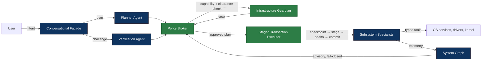

# Aios

Aios is my attempt at an operating system layer an AI can actually run, without
giving the AI root and hoping for the best.

> **Before working in this repository:** read
> [`PROJECT_GROUNDING.md`](PROJECT_GROUNDING.md), then follow its link to the
> latest dated project snapshot. It is the quickest way to recover the current
> architecture, code layout, implementation status, test conditions, and open
> work without rereading the entire repository.

The pitch, compressed: you tell your machine something is broken, and an agent
figures out what's wrong and fixes it — with a plan, a second opinion, a
checkpoint, and a way to undo the whole thing if it makes things worse.

> You type "why is my Wi-Fi not working?" → a planner agent proposes a
> diagnosis plan → a second agent tries to punch holes in that plan → the
> policy broker checks that each step is actually allowed → the change gets
> staged, health-checked, and committed or rolled back.

Every model output is a proposal, not a command. Nothing just happens.

[](LICENSE)
[](https://github.com/cse-creative-systems-engineering/aios/actions/workflows/ci.yml)

## The problem I'm trying to solve

Language models are genuinely good at figuring out what to do. They are bad at
being trusted to do it. They can be talked into anything by a prompt hiding in
a downloaded file, they hallucinate plausible-sounding plans, and they act on
state that is older than they think it is.

So the interesting question is not "how capable can we make the agent". It's
"how do you get the capability without giving away the machine." Most AI
tooling that touches the OS is a shell wrapper with extra steps. I'd rather
spend the effort on the boring part: making sure the agent can't do anything
that isn't planned, permitted, and reversible.

## The rule everything else follows

> No component gets to both decide what to do and have the authority to do it.

The whole design is that sentence, unfolded. To make it concrete, the system
is split into three planes:

- **Agent plane.** The chatty stuff: the planner, a verification agent that
  argues with it, subsystem specialists. Probabilistic. They propose, analyze,
  and explain. By default they hold no authority over the OS at all.
- **Enforcement plane.** The boring stuff that keeps the project honest: the
  policy broker, infrastructure guardian, staged transaction executor, audit
  log. Deterministic. Permission is granted here, actions are gated here, adn
  every move gets recorded here.
- **Trust plane.** Boot verification, watchdogs, recovery images. The layer
  that has to keep working when everything above it is broken.

The priority is explicit: Aios should lose its intelligence before it loses
the ability to recover safely. Closer to the hardware means more deterministic,
not less. Models may recommend. The hard limits are enforced by code that
can't be talked into anything.

## What actually happens when you ask for something

No agent "just does" anything. Every consequential action flows like this:

```text
you ask for something
  → planner proposes a structured plan
  → verification agent tries to break the plan
  → policy broker checks capability + clearance on every step
  → guardian checks safety invariants (risk level 2+)
  → you approve (risk level 3+, and only this plan)
  → executor checkpoints, stages, runs health checks
  → committed, or rolled back automatically
```

Permission is two-dimensional: an agent needs a capability (a specific
operation on a specific resource) and clearance (the risk level of the tool).
Those come from different places, and you can't trade one for the other.
Low-risk read-only stuff skips the ceremony. Anything touching the boot path
or firmware requires a scoped, expiring approval tied to the exact plan.

## Where the project actually is

It's further along than the first draft of this section claimed, but not done.

The design covers the security model, capability system, internal message
protocol, action state machine, specialist contracts, surface composition, and
milestone plans with acceptance criteria. I did the design first on purpose:
the hard problems here are about what an agent is *allowed* to do, and those
are cheaper to get wrong on paper than in production code.

There is now also a runnable core. `cargo run` drives the in-process demo
(broker, guardian, executor, mock planner and specialists against fake
hardware). `cargo run -- shell` boots the interactive shell: it loads
`~/.aios/config.toml`, runs a local Qwen model through llama.cpp, and routes
chat through the model gateway, with discovery, provider status, consent, and
a plan-and-verify flow. The current library baseline is 438 passing tests with
one ignored real-model test.

Milestones, briefly:

- **M0 — Design foundation.** Done.
- **M1 — In-process simulation.** Done. Broker, guardian, executor, and mock
  agents proving the contracts against each other in one process.
- **M2 — Read-only Linux discovery.** Done. Sysfs/procfs scanning, systemctl
  service discovery, reconciliation diff with `DeviceAdded`/`DeviceRemoved`
  events. Verified on a real machine: ~490 nodes.
- **M3 — Local model runtime.** Done. Model registry, router, gateway,
  pinner, SHA-256 hub verification, and a llama.cpp backend running a real
  Qwen GGUF offline.
- **M4 — Dual-agent orchestration.** Done. Config-driven providers, the
  OpenAI-compatible `HttpBackend`, the shell's planner + verifier against
  real models, read-only specialist tools wired to live discovery, and
  audit logging.
- **M5 — Transactions and staging.** Done. Checkpoint/stage/rollback against
  real services, with user approval and crash recovery.
- **M6 — First hardware specialist (Wi-Fi).** Done. Discover, diagnose,
  stage a driver, verify, roll back if it's worse. The vertical slice that
  proved the architecture works.
- **M7 — Additional specialists.** Done. Storage, Network, Drivers,
  Graphics, Memory, Power/thermal, Security/identity, Processes, Packages,
  and Boot/recovery, all with read-only observe/diagnose tools through the
  broker.
- **M8 — Generative surface desktop foundation.** The resident sidebar, live
  specialist evidence path, groundless surface generation, value validation,
  transparent canvas, click-through, and widget movement are working. The
  next lifecycle work is documented in
  `docs/milestones/0002-multi-surface-lifecycle-plan.md`.

## What I need help with

- **Finish M8.** Add multi-surface lifecycle, surface editing, multi-specialist
  composition, and the premium sidebar workstream. The current order and
  acceptance gates are in
  `docs/milestones/0002-multi-surface-lifecycle-plan.md`.
- **Find the flaw.** The docs are "frozen" in the sense that changing them is
  deliberately annoying, not forbidden. When the first real code contradicts
  them, the code wins. If you read something and it's wrong, an issue is the
  cheapest way to fix it — and I'd rather hear it now than after someone's
  Wi-Fi driver is mid-rollback.
- **Write the safety tests.** The testing strategy specifies whole families of
  tests that don't exist yet: capability escalation, fail-closed behavior,
  secret leakage, prompt-injection resistance. Described in detail, not
  written.
- **Author a specialist package.** The package format is fully specified.
  Pick a domain you know and write the manifest for it.

## Architecture, in one diagram



The dual-agent thing is deliberate. The planner and the verification agent are
separate roles, potentially running different models with different prompts, so
the two of them don't share the same blind spots. But their agreement is still
just a proposal until the enforcement plane accepts it. Specialists only ever
expose bounded tools — `observe_device`, `diagnose_fault`, `stage_change` —
never anything liek "run this command for me." The System Graph tracks hardware, services,
agents, and recovery paths, but it's a map, not a permissions database. If the
map is stale or wrong, the system assumes the worst.

## The documents

| Document | What's in it |
|---|---|
| [architecture.md](docs/architecture.md) | The vision, the three planes, how specialists fit |
| [security-model.md](docs/security-model.md) | What's trusted, what isn't, and what happens if it breaks |
| [capability-model.md](docs/capability-model.md) | Who's allowed to do what, and the broker's decision rules |
| [message-protocol.md](docs/message-protocol.md) | The typed messages agents actually exchange |
| [action-state-machine.md](docs/action-state-machine.md) | Transaction states, checkpoints, crash recovery |
| [system-graph.md](docs/system-graph.md) | How hardware and services are tracked, staleness handling |
| [agent-packages.md](docs/agent-packages.md) | What an installable agent contains and how it's signed |
| [model-routing.md](docs/model-routing.md) | Local vs internet models, offline behavior, data consent |
| [human-interaction.md](docs/human-interaction.md) | Approvals, escalations, what the user actually sees |
| [testing-strategy.md](docs/testing-strategy.md) | Six layers of tests, including the unwritten ones |
| [observability.md](docs/observability.md) | The audit log and tracing |
| [requirements.md](docs/requirements.md) | 32 traceable requirements, all the REQ-SAF-* ones included |
| [implementation-roadmap.md](docs/implementation-roadmap.md) | Core milestones M0–M8 with acceptance criteria |
| [glossary.md](docs/glossary.md) | Terms |
| [doc-progress.md](docs/doc-progress.md) | What's done and what's stuck |
| [decisions/](docs/decisions/) | ADR-0001 through ADR-0007 |

Current UI and surface documents:

| Document | What's in it |
|---|---|
| [ui.md](docs/ui.md) | Current Tauri UI and surface contract |
| [Foundation](docs/milestones/0001-generative-surface-desktop-foundation.md) | Working desktop checkpoint |
| [Lifecycle plan](docs/milestones/0002-multi-surface-lifecycle-plan.md) | Multi-surface and editing plan |
| [Archive](docs/archive/) | Historical and superseded documents |

Reading order: glossary → requirements → security-model → capability-model →
message-protocol → action-state-machine → system-graph → agent-packages →
model-routing → human-interaction. Takes an afternoon.

## Building

```bash
cargo build          # compile everything
cargo test           # run the test suite (438 library tests)
cargo run            # in-process demo: broker, guardian, mock agents
cargo run -- shell   # interactive shell against your real config and models
```

The shell reads `~/.aios/config.toml`. Point the `[model] path` at a GGUF
file, or leave providers empty and it runs degraded. Remote providers are
`[[provider]]` entries with an OpenAI-compatible endpoint; see
`model-routing.md` §6.3 for the shape.

## Contributing

[CONTRIBUTING.md](CONTRIBUTING.md) has the details. Security problems:
[SECURITY.md](SECURITY.md).

## License

PolyForm Noncommercial — see [LICENSE](LICENSE). Study and contribute freely.
No commercial use without permission.
