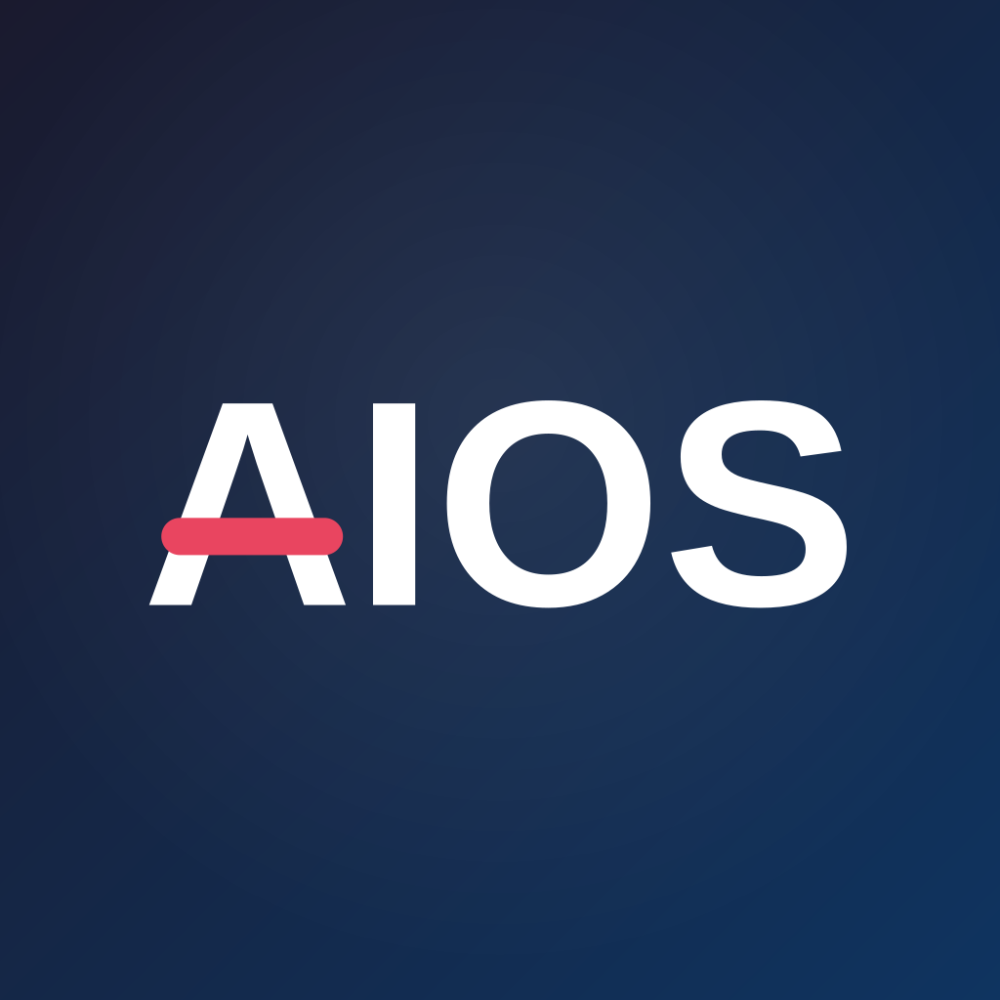
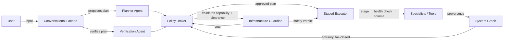

# Aios

<p align="center">
  
</p>

[](LICENSE)
[](https://github.com/cse-creative-systems-engineering/aios/actions/workflows/ci.yml)

Aios stands for **Artificially Intelligent Operating System**.

Aios is an AI-native operating environment that presents a single
conversational interface to the user, but internally coordinates
specialized agents and deterministic services to manage the OS and
hardware safely.

## Core safety principle

> No component should both make an autonomous decision and possess
> unrestricted authority to execute it.

Agents propose. The broker decides. The Guardian vetoes. Staged
execution tests before committing. Everything is reversible.

## System architecture



Components are separated by design: agents **propose**, the broker
**decides**, the Guardian **vetoes**, and the executor **acts** — no
single component both decides and executes.

## Current state

**Design phase — frozen for M1 implementation.** See the
[implementation roadmap](docs/implementation-roadmap.md) for milestone
details.

- **M0 — Foundation (design docs):** complete. 18 documents + 5 ADRs
  covering security model, capability-based authorization, typed message
  protocol, action state machine with crash recovery, system graph,
  agent packages, model routing, and human interaction.
- **M1 — In-process simulation:** in progress. Broker, Guardian,
  executor, graph, and mock agents in a single process.
- **M2+:** TBD.

The codebase is a minimal Rust 2024 binary scaffold. The doc set is
frozen: contract changes only happen when M1 surfaces a blocker, and
are recorded as ADRs.

## Key architectural decisions

- **v0.1 runs above Linux** in user space — no kernel modifications
  ([ADR-0001](docs/decisions/0001-v01-runs-above-linux.md))
- **Rust** as the implementation language — type system enforces
  capability boundaries
  ([ADR-0002](docs/decisions/0002-rust-as-implementation-language.md))
- **Fail-fast, no silent fallbacks** during development — every error
  surfaces immediately
  ([ADR-0003](docs/decisions/0003-fail-fast-no-silent-fallbacks.md))
- **Two-dimensional authorization** — capability (resource + operation)
  × tool risk level (0–4)
  ([ADR-0004](docs/decisions/0004-two-dimensional-authorization.md))

## Documentation

Start with the [architecture overview](docs/architecture.md), then read
the contract docs in dependency order:

```
glossary → requirements → security-model → capability-model →
message-protocol → action-state-machine → system-graph →
agent-packages → model-routing → human-interaction →
testing-strategy → observability → implementation-roadmap
```

See [doc-progress.md](docs/doc-progress.md) for the full status tracker.

## Build

```bash
cargo check    # verify the scaffold compiles
cargo run      # run the minimal binary
cargo test     # run tests
```

## Contributing

See [CONTRIBUTING.md](CONTRIBUTING.md). Security vulnerabilities: see
[SECURITY.md](SECURITY.md).

## License

PolyForm Noncommercial — see [LICENSE](LICENSE). Use, study, modify,
and contribute freely. No commercial use without permission.
