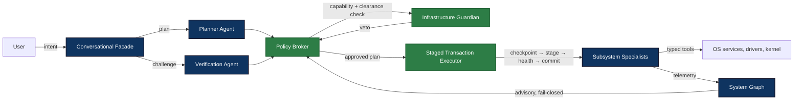

# Aios

**Aios** — *Artificially Intelligent Operating System* — is a design for an AI
that manages your OS and hardware the way an agent should: as a bounded,
accountable, reversible process, never as an unchecked authority.

Say *"my Wi-Fi is acting up"* and Aios decomposes that into diagnosis,
planning, verification, staged execution, and recovery — calling specialized
agents per subsystem, treating every model output as a **proposal** rather
than a command, and keeping every consequential change testable and
reversible.

[](LICENSE)
[](https://github.com/cse-creative-systems-engineering/aios/actions/workflows/ci.yml)

---

## The problem this is trying to solve

Language models are good at figuring out *what to do* and terrible at being
*trusted to do it*. An AI that manages an OS needs access to powerful
operations — and that same AI can be misled by a prompt hiding in a downloaded
file, hallucinate a plausible-but-wrong plan, or act on stale state.

The design question is not *"how capable can we make the agent"* but *"how do
we keep an intelligent system from becoming an uncontrolled safety or security
boundary."* That question is largely unsolved, and it's wide open.

## The governing principle

> **No component should both make an autonomous decision and possess
> unrestricted authority to execute it.**

Aios splits the answer into three planes:

| Plane | What lives there | Trust model |
|---|---|---|
| **Agent plane** | Conversational facade, Planner, Verification agent, subsystem specialists | Probabilistic. Agents propose, analyze, explain, monitor — they hold no OS authority by default |
| **Enforcement plane** | Policy Broker, Infrastructure Guardian, Staged Transaction Executor, audit log | Deterministic. Grants, gates, stages, and records every action |
| **Trust plane** | Boot verification, watchdogs, recovery images, kernel primitives | Lowest-level integrity. Must keep working if both other planes fail |

And the rule that outranks every other: *Aios should lose intelligence before
it loses the ability to recover safely.* The closer a component gets to
hardware, the more deterministic and constrained it must be — AI may diagnose,
predict, and recommend; deterministic controllers enforce the hard limits.

## How an action actually happens

No agent "just does" anything. Every consequential action is a staged
transaction through the enforcement plane:

```text
User intent
  → Planner proposes a structured plan
  → Verification agent independently challenges it
  → Policy Broker validates capability + clearance
  → Guardian checks invariants (risk 2+)
  → User approves (risk 3+, scoped to this plan)
  → Executor checkpoints, stages, health-verifies
  → Committed, or rolled back
```

Authorization is **two-dimensional** — an agent needs both a valid capability
(resource + operation) and sufficient clearance (tool risk level 0–4), granted
by different mechanisms. Risk levels 0–1 skip the heavyweight path; levels 3–4
require scoped, expiring user approval bound to a plan hash.

## Where things stand

**The design is done and frozen.** This repo is 18 documents and 5
architecture decision records (~9,000 lines) that pin down the security model,
authorization, protocol, state machines, and milestone plan tightly enough to
implement from. Every contract is written to be implemented from, and every
claim is traceable to a requirement.

What is **not** done is the implementation — that's the interesting part, and
it's deliberately where you come in:

- **M0 — Design foundation ✅** 18 docs + 5 ADRs frozen for M1; core contracts 8/8
- **M1 — In-process simulation 🔨** The next milestone, and the best entry
  point. Build the Policy Broker, Guardian, Staged Transaction Executor,
  System Graph, and action state machine in one process with mock hardware and
  mock models. No kernel, no real devices, no GPUs — just prove the contracts
  actually work together. 3–4 weeks.
- **M2–M5** Real Linux discovery → local model runtime → dual-agent
  orchestration → transactions and staging
- **M6** First hardware specialist: Wi-Fi, end-to-end (discover → diagnose →
  stage → verify) — the vertical slice that validates the whole architecture

## Ways to get involved

- **Build M1.** The [milestone](docs/implementation-roadmap.md#milestone-1-in-process-simulation)
  has explicit acceptance criteria and a
  [testing strategy](docs/testing-strategy.md) ready for it. Start with the
  broker — it's the trusted computing base, and every decision path is
  specified.
- **Attack the design.** The docs are frozen *until M1 proves them wrong.*
  Find the flaw in the capability model, the state machine, or a threat model
  gap? Open an issue — the security model expects to be stress-tested.
- **Write a test.** The [testing strategy](docs/testing-strategy.md) lists
  whole families of safety-specific tests (capability escalation, fail-closed,
  secret leakage, prompt injection resistance) that are specified but
  unwritten.
- **Design a specialist package.** The
  [agent package](docs/agent-packages.md) format is specified end-to-end —
  write the package manifest for a domain you know well.
- **Read the design and tell us what's broken.** The
  [suggested reading order](#reading-order) takes an afternoon.

The docs are frozen by rule, not by pride: contract changes happen when a
milestone surfaces a real blocker, and every change is recorded as an ADR.
Fail-fast is a project rule, not just a code rule — a milestone is only
complete when its acceptance tests pass.

## Architecture at a glance



The **dual-agent bridge** is deliberate: Planner and Verification are separate
roles that may use different models, prompts, or tools, so correlated blind
spots are less likely — but their agreement is *advisory* until the
enforcement plane accepts it. Specialists expose **bounded, typed tools**
(`observe_device`, `diagnose_fault`, `stage_change`) — never
`run_any_command`. The **System Graph** tracks hardware, services, agents,
capabilities, and recovery paths, but it is a map, not a permission authority:
when graph data is stale, missing, or conflicting, the system fails closed.

## The document set

| Document | What it pins down |
|---|---|
| [architecture.md](docs/architecture.md) | Vision, principles, the three planes, specialist model |
| [security-model.md](docs/security-model.md) | Threat model, trusted computing base, compromise scenarios |
| [capability-model.md](docs/capability-model.md) | Principals, resources, capability tokens, broker decision algorithm, Rust types |
| [message-protocol.md](docs/message-protocol.md) | Typed internal protocol, delivery semantics, error handling |
| [action-state-machine.md](docs/action-state-machine.md) | Transaction states, checkpoints, crash and power-loss recovery |
| [system-graph.md](docs/system-graph.md) | Node/edge types, provenance, staleness, conflict handling |
| [agent-packages.md](docs/agent-packages.md) | Signed package manifests, registry, lifecycle |
| [model-routing.md](docs/model-routing.md) | Provider tiers, offline fallback, data-class consent |
| [human-interaction.md](docs/human-interaction.md) | Approval, escalation, facade trust, user-absent recovery |
| [testing-strategy.md](docs/testing-strategy.md) | Six test layers, safety-specific tests, evaluations |
| [observability.md](docs/observability.md) | Audit log, tracing, metrics, health read model |
| [requirements.md](docs/requirements.md) | 32 traceable requirements (safety, functional, perf, reliability) |
| [implementation-roadmap.md](docs/implementation-roadmap.md) | Milestones M0–M8 with acceptance criteria |
| [glossary.md](docs/glossary.md) | Shared terminology |
| [doc-progress.md](docs/doc-progress.md) | Live status tracker with dependency graph |
| [decisions/](docs/decisions/) | ADR-0001–0005, the accepted architectural decisions |

### Reading order

glossary → requirements → security-model → capability-model →
message-protocol → action-state-machine → system-graph → agent-packages →
model-routing → human-interaction.

## Quick start

The repo is a minimal Rust 2024 binary scaffold — enough to verify the
toolchain, not yet the system.

```bash
cargo check    # verify the scaffold compiles
cargo test     # run tests
```

Real implementation starts at M1; see the
[roadmap](docs/implementation-roadmap.md#milestone-1-in-process-simulation)
for what M1 must prove.

## Contributing

See [CONTRIBUTING.md](CONTRIBUTING.md). Security vulnerabilities: see
[SECURITY.md](SECURITY.md).

## License

PolyForm Noncommercial — see [LICENSE](LICENSE). Use, study, modify, and
contribute freely. No commercial use without permission.
