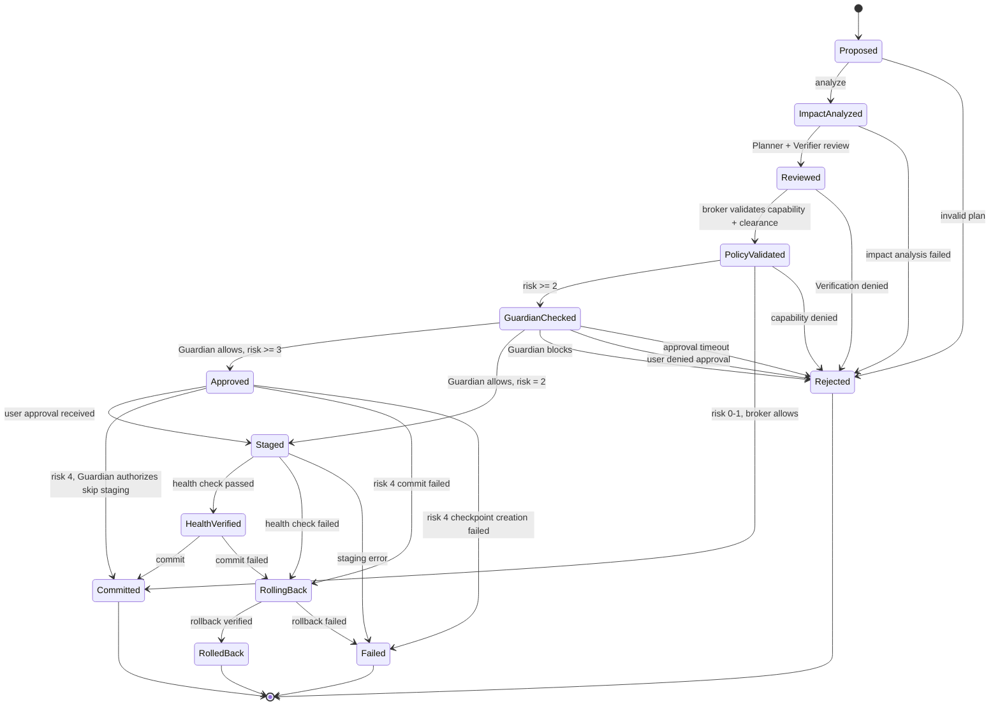

# Aios Action State Machine

**Status:** Draft — frozen for M1  
**Depends on:** architecture.md, glossary.md, requirements.md, security-model.md, capability-model.md, message-protocol.md, decisions/0003-fail-fast-no-silent-fallbacks.md, decisions/0004-two-dimensional-authorization.md

## Purpose

Define how an operation moves from proposal to commit or rollback, including
all intermediate states, transitions, partial-failure behavior, crash
recovery, and power-loss recovery.

### Design principles

1. **Every action has a durable state.** Action state is persisted so that
   partially executed actions can be detected and recovered on restart
   (REQ-REL-004).
2. **Fail-fast at every transition.** If a transition fails, the action does
   not silently proceed. It enters `Failed` or `RolledBack` (ADR-0003).
3. **No silent fallbacks.** If a health check fails, the action rolls back.
   If rollback fails, the action enters `Failed` and requires manual
   recovery. No degraded-but-silent states.
4. **Risk level determines the path.** Risk level 0–1 actions skip staging and
   health verification. Risk level 2+ actions require staging, health
   verification, and potentially user approval (ADR-0004).
5. **Checkpoints are mandatory for mutations.** Any action at risk level 2+
   creates a checkpoint before staging. The checkpoint is the rollback
   target.

---

## 1. States

```rust
pub enum ActionState {
    Proposed,
    ImpactAnalyzed,
    Reviewed,
    PolicyValidated,     // Broker validates before Guardian reviews
    GuardianChecked,     // Guardian review for risk level 2+
    Approved,
    Staged,
    HealthVerified,
    RollingBack,      // Intermediate state during rollback
    Committed,
    RolledBack,
    Rejected,
    Failed,
}
```

`RollingBack` is a non-terminal state entered when rollback begins. This
allows the system to distinguish "rollback in progress" from "rollback
complete" during crash recovery.

| State | Description | Risk levels that reach this state |
|---|---|---|
| `Proposed` | Plan exists, not yet reviewed | All |
| `ImpactAnalyzed` | System Graph consulted, affected systems identified | All |
| `Reviewed` | Planner and Verification Agent have weighed in | All |
| `PolicyValidated` | Capabilities and clearance confirmed by broker | All |
| `GuardianChecked` | Guardian has returned Allow or Block | 2+ |
| `Approved` | User approval obtained (if required) | 3+ |
| `Staged` | Checkpoint created, change applied in staging | 2+ |
| `HealthVerified` | Health checks passed after staging | 2+ |
| `RollingBack` | Rollback in progress (intermediate, non-terminal) | 2+ |
| `Committed` | Change is live and permanent | All (0–1 skip staging) |
| `RolledBack` | Change reverted, previous state restored | 2+ |
| `Rejected` | Blocked at any stage, not executed | All |
| `Failed` | Unexpected error, may need manual recovery | All |

### Terminal states

`Committed`, `RolledBack`, `Rejected`, `Failed` are terminal. No transitions
out of terminal states. A new action must be created to retry.

`RollingBack` is non-terminal — it transitions to `RolledBack` (success) or
`Failed` (rollback failed).

---

## 2. State Diagram



---

## 3. Transitions

### 3.1 Transition table

| From | To | Trigger | Automatic? | Risk levels |
|---|---|---|---|---|
| `Proposed` | `ImpactAnalyzed` | System Graph consulted | Yes | All |
| `Proposed` | `Rejected` | Invalid plan structure | Yes | All |
| `ImpactAnalyzed` | `Reviewed` | Planner + Verification Agent complete | Yes | All |
| `ImpactAnalyzed` | `Rejected` | Impact analysis reveals critical conflict | Yes | All |
| `Reviewed` | `PolicyValidated` | Broker validates capability + clearance | Yes | All |
| `Reviewed` | `Rejected` | Verification Agent rejects | Yes | All |
| `PolicyValidated` | `GuardianChecked` | Risk >= 2, forward to Guardian | Yes | 2+ |
| `PolicyValidated` | `Committed` | Risk 0–1, broker allows | Yes | 0–1 |
| `PolicyValidated` | `Rejected` | Capability or clearance denied | Yes | All |
| `GuardianChecked` | `Approved` | Guardian allows, risk >= 3 | No (user) | 3+ |
| `GuardianChecked` | `Staged` | Guardian allows, risk = 2 | Yes | 2 |
| `GuardianChecked` | `Rejected` | Guardian blocks | Yes | 2+ |
| `GuardianChecked` | `Rejected` | User denied approval | No (user) | 3+ |
| `GuardianChecked` | `Rejected` | Approval timeout | Yes (timeout) | 3+ |
| `Approved` | `Rejected` | Crash recovery: action interrupted before staging | Yes (recovery) | 3+ |
| `Approved` | `Staged` | User approval received | Yes | 3+ |
| `Approved` | `Committed` | Risk 4, Guardian authorizes skip staging (checkpoint created first) | Yes | 4 |
| `Approved` | `RollingBack` | Risk 4 commit failed (rollback to checkpoint) | Yes (auto) | 4 |
| `Approved` | `Failed` | Risk 4 checkpoint creation failed | Yes | 4 |
| `Staged` | `HealthVerified` | Health check passed | Yes | 2+ |
| `Staged` | `RollingBack` | Health check failed | Yes (auto) | 2+ |
| `Staged` | `Failed` | Staging error (non-recoverable) | Yes | 2+ |
| `HealthVerified` | `Committed` | Commit successful | Yes | 2+ |
| `HealthVerified` | `RollingBack` | Commit failed | Yes (auto) | 2+ |
| `RollingBack` | `RolledBack` | Rollback verified | Yes (auto) | 2+ |
| `RollingBack` | `Failed` | Rollback failed (checkpoint missing/corrupted) | Yes | 2+ |

### 3.2 Risk-level fast paths

Not all actions pass through all states. The risk level determines the path:

```text
Risk 0 (Read-only):
  Proposed → ImpactAnalyzed → Reviewed → PolicyValidated → Committed

Risk 1 (Routine):
  Proposed → ImpactAnalyzed → Reviewed → PolicyValidated → Committed

Risk 2 (Staged mutation):
  Proposed → ImpactAnalyzed → Reviewed → PolicyValidated
    → GuardianChecked → Staged → HealthVerified → Committed

Risk 3 (Critical mutation):
  Proposed → ImpactAnalyzed → Reviewed → PolicyValidated
    → GuardianChecked → Approved → Staged → HealthVerified → Committed

Risk 4 (Recovery):
  Proposed → ImpactAnalyzed → Reviewed → PolicyValidated
    → GuardianChecked → Approved → Committed
  (Recovery operations may skip staging if the Guardian authorizes it.
   A checkpoint is still created before the direct commit, so rollback
   is available if the commit fails. If the Guardian does not authorize
   skip-staging, the action follows the risk-3 path.)
```

---

## 4. Checkpoints

### 4.1 What is captured

A checkpoint captures the state needed to roll back a specific action:

```rust
pub struct Checkpoint {
    pub checkpoint_id: CheckpointId,
    pub action_id: ActionId,
    pub resource: ResourceId,
    pub created_at: Timestamp,
    pub state: CheckpointState,
}

pub enum CheckpointState {
    ConfigBackup { path: String, content_hash: [u8; 32] },
    DriverBackup { module: String, version: String, backup_path: String },
    ServiceState { service: String, state: String },
    FirmwareBackup { device: String, firmware_ref: String },
    BootConfigBackup { config_path: String, content_hash: [u8; 32] },
    Empty,  // For operations with no rollback target (e.g., read-only)
}
```

### 4.2 Storage

| Version | Storage |
|---|---|
| v0.1 | Local filesystem under a managed directory (e.g., `/var/lib/aios/checkpoints/`) |
| v0.2+ | Dedicated checkpoint store with integrity verification |

### 4.3 Checkpoint verification

Before staging, the checkpoint is verified:
- The checkpoint file exists and is readable.
- The content hash matches (if applicable).
- The checkpoint was created by the current action (not stale).

If verification fails → fail-fast, action enters `Rejected`.

### 4.4 Checkpoint cleanup

Checkpoints are deleted after:
- `Committed` — the change is permanent, checkpoint no longer needed.
- `RolledBack` — the rollback is complete, checkpoint consumed.
- `Failed` — checkpoint is **retained** for manual recovery analysis.

---

## 5. Action Persistence

### 5.1 Action record

Every action is persisted to durable storage so it survives crashes:

```rust
pub struct ActionRecord {
    pub action_id: ActionId,
    pub correlation_id: CorrelationId,
    pub state: ActionState,
    pub risk_level: RiskLevel,
    pub resource: ResourceId,
    pub operation: Operation,
    pub principal: PrincipalId,
    pub checkpoint_id: Option<CheckpointId>,
    pub created_at: Timestamp,
    pub updated_at: Timestamp,
    pub state_history: Vec<StateTransition>,
}

pub struct StateTransition {
    pub from: ActionState,
    pub to: ActionState,
    pub timestamp: Timestamp,
    pub reason: String,
}
```

### 5.2 Storage

| Version | Storage |
|---|---|
| v0.1 | Local file (e.g., `/var/lib/aios/actions/<action_id>.json`) |
| v0.2+ | Embedded database (SQLite or similar) with atomic writes |

### 5.3 Write semantics

- State transitions are recorded in a transition journal **before** the
  transition is executed (write-ahead). The journal records the intent
  (from → to, timestamp, reason).
- The `state` field in the `ActionRecord` is updated to the next state
  **only after** the transition completes successfully. If the process
  crashes during a transition, the `state` field shows the **current**
  state (the transition did not complete), and the journal shows the
  intent.
- On restart, the executor reads the `state` field (current state) and
  the journal (any pending intent). If there is a pending intent that
  was not completed, the executor recovers from the current state.
- Writes are atomic (fsync). No partial records.
- This ensures that a crash during a transition never leaves the system
  in a state that appears further along than it actually is.

---

## 6. Crash and Power-Loss Recovery

### 6.1 Recovery on restart

When Aios restarts, the executor reads all persisted action records:

```text
For each ActionRecord:
  if state is terminal (Committed, RolledBack, Rejected, Failed):
    → No action needed. Log for audit.

  if state is non-terminal:
    → The action was interrupted. Recovery depends on the state:

    Proposed, ImpactAnalyzed, Reviewed:
      → Action was not yet executing. Mark as Rejected (interrupted).
        The caller can retry if desired.

    GuardianChecked, PolicyValidated, Approved (staging path, not risk-4 skip-staging):
      → Action was validated but not yet staging. Mark as Rejected
        (interrupted). The caller can retry.

    Staged:
      → A change was staged but not health-checked or committed.
        This is the dangerous case. Run health check:
        - If health check passes → commit (the change is already applied).
        - If health check fails → RollingBack → rollback to checkpoint.
        - If checkpoint is missing or invalid → Failed (manual
          recovery required).

    RollingBack:
      → Rollback was in progress when the crash occurred.
        Re-attempt rollback:
        - If rollback succeeds and verifies → RolledBack.
        - If rollback fails → Failed.

    HealthVerified:
      → Health check passed but commit did not complete. Attempt commit:
        - If commit succeeds → Committed.
        - If commit fails → RollingBack → rollback to checkpoint.
        - If checkpoint is missing → Failed.

    Approved (risk 4, skip-staging path):
      → A risk-4 direct commit was in progress. A checkpoint was created
        before the commit (per design principle 5). Probe the resource:
        - If commit was already applied → Committed.
        - If commit was not applied → attempt commit:
          - If commit succeeds → Committed.
          - If commit fails → RollingBack → rollback to checkpoint.
        - If commit was partially applied → RollingBack → rollback to checkpoint.
        - If checkpoint is missing/corrupted → Failed (manual recovery).
        - Do NOT silently mark as Rejected — the mutation may have been
          partially applied.
```

### 6.2 Recovery principles

1. **Never silently lose an action.** Every interrupted action is detected
   and resolved to a terminal state on restart.
2. **Prefer rollback over commit on ambiguity.** If we can't determine
   whether a staged change is safe, roll back.
3. **Failed state requires human attention.** If rollback fails or a
   checkpoint is missing, the action enters `Failed` and is surfaced to the
   user. No silent recovery from an unknown state.
4. **Recovery does not require AI.** The executor recovers deterministically
   from persisted state. No model calls needed (REQ-REL-002).

### 6.3 Power-loss during commit

If power is lost during the commit step:
- The action record shows `HealthVerified` (write-ahead log).
- On restart, the executor sees `HealthVerified` and attempts commit.
- If the change was already applied (idempotent commit) → `Committed`.
- If the change was not applied → apply and commit.
- If the change was partially applied → rollback if possible, else `Failed`.

To support this, commit operations should be **idempotent** — applying the
same commit twice should produce the same result.

---

## 7. Automatic vs Manual Rollback

### 7.1 Automatic rollback

Rollback is automatic when:
- Health check fails after staging.
- Commit fails after health verification.
- The executor detects an interrupted `Staged` action on restart.

Automatic rollback:
1. Load the checkpoint.
2. Verify checkpoint integrity.
3. Apply the checkpoint (restore previous state).
4. Verify restoration (health check).
5. Transition to `RolledBack`.
6. Delete checkpoint.
7. Audit log entry.

### 7.2 Manual recovery

Manual recovery is required when:
- Rollback fails (checkpoint is missing, corrupted, or restoration fails).
- The action is in `Failed` state.
- The system is in an unknown state after a crash.

Manual recovery:
1. The action enters `Failed`.
2. The user is notified with the action details, checkpoint reference, and
   last known state.
3. The user can invoke a recovery operation (risk level 4) to restore the
   system to a known-good state.
4. Recovery operations go through the same state machine — they are not a
   bypass.

### 7.3 Recovery supervisor

v0.1: No dedicated recovery supervisor. The executor handles recovery on
restart. The user is the recovery supervisor for `Failed` actions.

v0.2+: A dedicated recovery supervisor that runs independently of the main
Aios process. It can detect `Failed` actions, invoke recovery operations,
and verify system integrity. This is part of the trust plane.

---

## 8. Rust Types

```rust
use crate::capability::{ResourceId, Operation, RiskLevel, PrincipalId};
use crate::protocol::{ActionId, CorrelationId, Timestamp};

// ── Action state ──

#[derive(Clone, Copy, Debug, PartialEq, Eq)]
pub enum ActionState {
    Proposed,
    ImpactAnalyzed,
    Reviewed,
    PolicyValidated,     // Broker validates before Guardian reviews
    GuardianChecked,     // Guardian review for risk level 2+
    Approved,
    Staged,
    HealthVerified,
    RollingBack,
    Committed,
    RolledBack,
    Rejected,
    Failed,
}

impl ActionState {
    pub fn is_terminal(&self) -> bool {
        matches!(self, 
            ActionState::Committed | 
            ActionState::RolledBack | 
            ActionState::Rejected | 
            ActionState::Failed
        )
    }
}

// ── Action record ──

#[derive(Clone, Debug)]
pub struct ActionRecord {
    pub action_id: ActionId,
    pub correlation_id: CorrelationId,
    pub state: ActionState,
    pub risk_level: RiskLevel,
    pub resource: ResourceId,
    pub operation: Operation,
    pub principal: PrincipalId,
    pub checkpoint_id: Option<CheckpointId>,
    pub created_at: Timestamp,
    pub updated_at: Timestamp,
    pub state_history: Vec<StateTransition>,
}

#[derive(Clone, Debug)]
pub struct StateTransition {
    pub from: ActionState,
    pub to: ActionState,
    pub timestamp: Timestamp,
    pub reason: String,
}

// ── Checkpoint ──

#[derive(Clone, Debug)]
pub struct Checkpoint {
    pub checkpoint_id: CheckpointId,
    pub action_id: ActionId,
    pub resource: ResourceId,
    pub created_at: Timestamp,
    pub state: CheckpointState,
}

#[derive(Clone, Debug)]
pub enum CheckpointState {
    ConfigBackup { path: String, content_hash: [u8; 32] },
    DriverBackup { module: String, version: String, backup_path: String },
    ServiceState { service: String, state: String },
    FirmwareBackup { device: String, firmware_ref: String },
    BootConfigBackup { config_path: String, content_hash: [u8; 32] },
    Empty,
}

pub type CheckpointId = uuid::Uuid;

// ── Executor ──

pub trait ActionExecutor {
    fn create_action(&mut self, request: &ToolRequest) -> Result<ActionId, ActionError>;
    fn transition(&mut self, action_id: &ActionId, to: ActionState, reason: &str) 
        -> Result<(), TransitionError>;
    fn create_checkpoint(&mut self, action_id: &ActionId) -> Result<CheckpointId, CheckpointError>;
    fn verify_checkpoint(&self, checkpoint_id: &CheckpointId) -> Result<(), CheckpointError>;
    fn stage(&mut self, action_id: &ActionId) -> Result<(), StageError>;
    fn health_check(&mut self, action_id: &ActionId) -> Result<HealthReport, HealthError>;
    fn commit(&mut self, action_id: &ActionId) -> Result<(), CommitError>;
    fn rollback(&mut self, action_id: &ActionId) -> Result<(), RollbackError>;
    fn load_record(&self, action_id: &ActionId) -> Result<ActionRecord, PersistenceError>;
    fn recover(&mut self) -> Vec<RecoveryOutcome>;
}

#[derive(Clone, Debug)]
pub struct RecoveryOutcome {
    pub action_id: ActionId,
    pub from_state: ActionState,
    pub to_state: ActionState,
    pub reason: String,
}

#[derive(Debug)]
pub enum ActionError {
    InvalidRequest,
    PersistenceFailed(String),
}

#[derive(Debug)]
pub enum StageError {
    CheckpointMissing,
    ResourceUnavailable,
    Internal(String),
}

#[derive(Debug)]
pub enum HealthError {
    SubsystemUnavailable,
    CheckFailed(String),
    Internal(String),
}

#[derive(Debug)]
pub enum CommitError {
    AlreadyCommitted,  // Idempotent: commit was already applied
    PartiallyApplied,  // Commit was partially applied — needs manual recovery
    Internal(String),
}

#[derive(Debug)]
pub enum PersistenceError {
    RecordNotFound,
    RecordCorrupted(String),
    StorageFailed(String),
}

#[derive(Debug)]
pub enum TransitionError {
    InvalidTransition { from: ActionState, to: ActionState },
    ActionNotFound(ActionId),
    PersistenceFailed(String),
}

#[derive(Debug)]
pub enum CheckpointError {
    ResourceNotCheckpointable(ResourceId),
    StorageFailed(String),
    VerificationFailed(String),
}

#[derive(Debug)]
pub enum RollbackError {
    CheckpointMissing(CheckpointId),
    CheckpointCorrupted(CheckpointId),
    RestorationFailed(String),
    HealthCheckFailed(String),
}
```

---

## 9. Open questions

1. **Checkpoint retention for `Failed` actions.** How long are checkpoints
   retained for manual recovery? Indefinitely? Until the user acknowledges?
   (Recommendation: retain until user acknowledges or explicitly deletes.)
2. **Concurrent actions on the same resource.** If two actions target the
   same resource, should they be serialized, or can they run concurrently?
   (Recommendation: serialize — one action per resource at a time, per the
   protocol's per-resource serialization rule.)
3. **Action timeout.** Should there be a maximum action lifetime beyond the
   per-request deadline? (Recommendation: yes — an action that has been in
   a non-terminal state for longer than a configurable timeout is marked
   `Failed` and recovered.)
4. **Nested actions.** Can an action spawn sub-actions? (Recommendation: not
   in v0.1. Each action is independent. If a plan requires multiple actions,
   they are sequenced by the Planner, not nested.)
5. **Checkpoint compression.** For large checkpoints (e.g., full firmware
   backups), should checkpoints be compressed? (Recommendation: yes, but
   defer to implementation — the checkpoint format should support optional
   compression.)

---

## References

- `docs/architecture.md` — section 9 (critical action lifecycle), section 15
  (gaps: action state and transactions)
- `docs/security-model.md` — section 6 (recovery security), section 4.2
  (broker compromise)
- `docs/capability-model.md` — section 5 (broker decision algorithm), section
  4 (tool risk levels)
- `docs/message-protocol.md` — section 2 (message types: `ToolRequest`,
  `ToolResult`, `PolicyDecision`, `GuardianDecision`)
- `docs/requirements.md` — REQ-REL-001 (automatic rollback), REQ-REL-004
  (durable action state)
- `docs/decisions/0003-fail-fast-no-silent-fallbacks.md` — failed
  transitions do not silently proceed
- `docs/decisions/0004-two-dimensional-authorization.md` — risk level
  determines the action path
