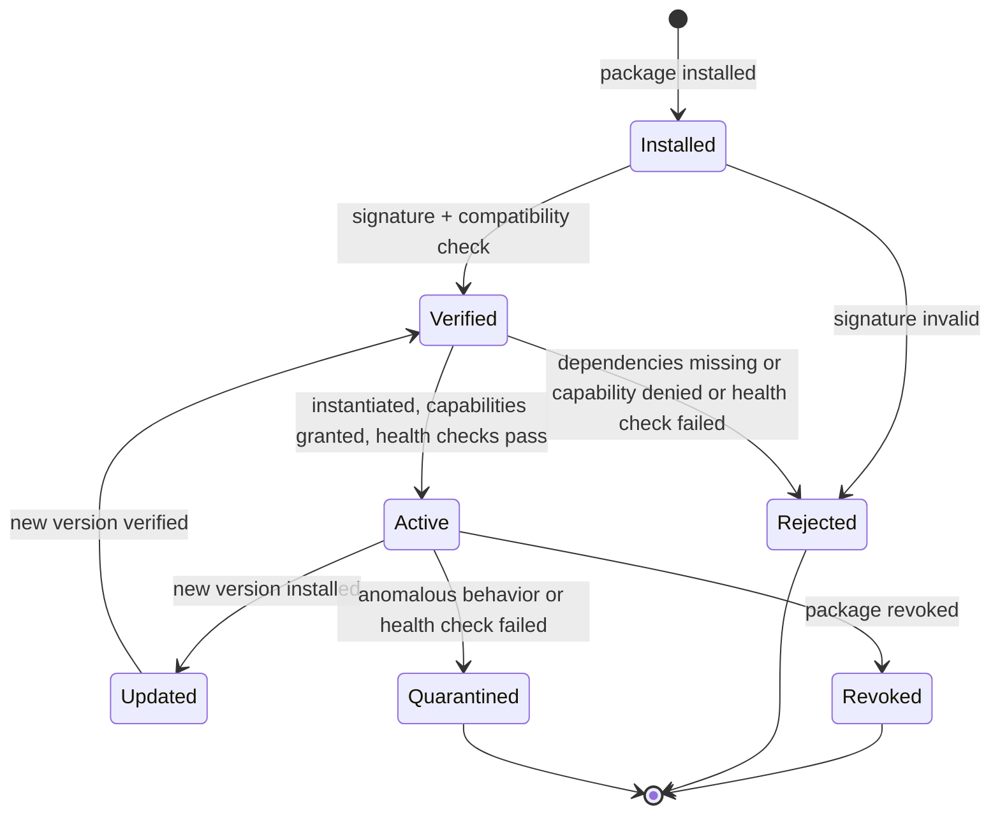

# Aios Agent Packages

**Status:** Draft — frozen for M1  
**Depends on:** architecture.md, glossary.md, requirements.md, security-model.md, capability-model.md, message-protocol.md, system-graph.md, model-routing.md, decisions/0001-v01-runs-above-linux.md, decisions/0002-rust-as-implementation-language.md, decisions/0003-fail-fast-no-silent-fallbacks.md, decisions/0004-two-dimensional-authorization.md

## Purpose

Define the Agent Package manifest format, registry, signing, versioning,
lifecycle, and the discovery-to-instantiation pipeline that maps System Graph
nodes to packages.

### Design principles

1. **A package is more than a prompt.** It contains manifest, tools,
   capabilities, invariants, health checks, recovery rules, model policy,
   resource budgets, data policy, and tests.
2. **Context never grants authority.** A package requests capabilities; the
   broker grants them. Node-specific context is injected at instantiation,
   but authority comes only from the broker.
3. **Packages are signed and versioned.** Unsigned or modified packages are
   rejected. Package updates do not silently broaden existing capabilities.
4. **Dependencies are explicit.** A package may declare dependencies on other
   packages. Missing dependencies cause fail-fast at instantiation.
5. **Unknown resources get read-only inspection or quarantine.** Aios never
   invents or activates a privileged Agent Package at runtime.
6. **Fail-fast on lifecycle errors.** If verification, health checks, or
   compatibility checks fail, the package is not activated.

---

## 1. Package Manifest Schema

### 1.1 Manifest structure

```yaml
package: aios.specialist.network.wifi
package_type: specialist
version: 1
clearance: 4

matches:
  - node_type: Device
    attributes:
      class: network
      bus: pci
      subclass: wireless
  - node_type: Device
    attributes:
      class: network
      bus: usb
      subclass: wireless

dependencies:
  - package: aios.specialist.network
    min_version: 1

tools:
  - id: observe_device
    risk_level: 0
    operation: Observe
    description: "Read device state and telemetry"
  - id: diagnose_fault
    risk_level: 0
    operation: Diagnose
    description: "Analyze a Wi-Fi fault"
  - id: stage_driver
    risk_level: 2
    operation: Stage
    description: "Stage a new driver for testing"
  - id: request_reset
    risk_level: 4
    operation: Reset
    description: "Reset the Wi-Fi device"

capabilities:
  - resource: "${device}"
    operations: [Observe, Diagnose, Query, Restart, Stage, Commit, Reset]

events:
  - DeviceAdded
  - LinkStateChanged
  - FirmwareError

invariants:
  - DRIVER-001
  - NETWORK-002

recovery:
  - quarantine_device
  - restore_previous_driver

model_policy: local_or_approved_gateway
data_policy: system_hardware_local_or_trusted_gateway

resource_budgets:
  cpu_cores: 1
  memory_mb: 256
  storage_mb: 50
  latency_ms: 100
  power_watts: 5

tests:
  - wifi.discovery
  - wifi.driver_staging
  - wifi.rollback
```

### 1.2 Manifest fields

| Field | Required | Description |
|---|---|---|
| `package` | Yes | Unique package identifier (e.g., `aios.specialist.network.wifi`) |
| `package_type` | Yes | One of: core, coordinator, specialist, guardian, interface, gateway |
| `version` | Yes | Integer version number. Monotonically increasing. |
| `clearance` | Yes | Maximum tool risk level (0–4) this agent may use |
| `matches` | Specialist only | Node types and attributes this package handles |
| `dependencies` | No | Other packages that must be loaded before this one |
| `tools` | Yes | Typed tool interfaces exposed by this agent |
| `capabilities` | Yes | Capability classes requested (not granted) |
| `events` | No | Event types this agent subscribes to |
| `invariants` | No | Operational Contract invariants this agent respects |
| `recovery` | No | Recovery actions available to this agent |
| `model_policy` | Yes | Model routing policy for this agent |
| `data_policy` | Yes | Data classification routing for this agent |
| `resource_budgets` | Yes | CPU, memory, storage, latency, power limits |
| `tests` | No | Test suite names for this package |

### 1.3 Variable substitution

Capabilities use `${device}` as a placeholder for the resource identifier.
At instantiation, the broker replaces `${device}` with the actual resource ID
(e.g., `device:wifi0`). This allows one package to be instantiated for
multiple devices of the same type.

---

## 2. Package Types

| Type | Examples | Typical scope | Instantiation |
|---|---|---|---|
| **Core** | Planner, Verification Agent | System or session singleton | One instance per system |
| **Coordinator** | Session Coordinator, model router | System or user session | One instance per session |
| **Specialist** | Wi-Fi, Storage, Security, Power | Domain or hardware resource | One per matching resource |
| **Guardian** | Infrastructure Guardian, recovery monitor | System-wide safety boundary | One instance per system |
| **Interface** | Chat interface, System State panel | User session or desktop | One per user session |
| **Gateway** | Local or LAN model gateway adapter | Host or trusted gateway | One per gateway |

Not every package creates an LLM process. A package may instantiate:
- A deterministic service (telemetry, hard real-time behavior)
- A read-only diagnostic specialist
- An AI-assisted specialist with bounded tools
- A coordinator for a group of related resources

---

## 3. Signing and Integrity

### 3.1 Package format

A package is a directory:

```text
aios.specialist.network.wifi/
├── manifest.yaml          # Signed manifest
├── manifest.sig           # Signature for manifest
├── prompt.txt             # System prompt (if AI-assisted)
├── tools/                 # Tool implementations (native Rust in v0.1, WASM in v0.2+)
│   ├── observe_device.rs
│   ├── diagnose_fault.rs
│   └── stage_driver.rs
├── tests/
│   ├── discovery.rs
│   └── driver_staging.rs
└── README.md
```

### 3.2 Signing

| Version | Mechanism |
|---|---|
| v0.1 | Local Ed25519 key. Manifest is signed; signature stored in `manifest.sig`. |
| v0.2+ | Key management with revocation, rotation, and trusted publisher registry. |

At load time:
1. Read `manifest.yaml`.
2. Read `manifest.sig`.
3. Verify signature against the trusted key.
4. If verification fails → reject package, fail-fast.

### 3.3 Tamper detection

- Any modification to `manifest.yaml` after signing invalidates the signature.
- Tool implementations are hashed in the manifest. Modified tools invalidate
  the package.
- Unsigned packages are never loaded.

---

## 4. Registry

### 4.1 Purpose

The registry stores all available packages, indexed for lookup by node type,
role, or name.

### 4.2 Structure

```rust
pub struct PackageRegistry {
    packages: HashMap<PackageId, Vec<PackageVersion>>,  // All versions
    by_node_type: HashMap<NodeType, Vec<PackageId>>,    // For matching
    active_versions: HashMap<PackageId, u32>,           // Currently active
}
```

### 4.3 Lookup

```rust
pub trait RegistryQuery {
    /// Find packages that match a graph node
    fn find_matching(&self, node: &NodeMetadata) -> Vec<PackageId>;

    /// Get a specific package version
    fn get_package(&self, id: &PackageId, version: u32) -> Option<&PackageVersion>;

    /// Get the active version of a package
    fn get_active(&self, id: &PackageId) -> Option<&PackageVersion>;

    /// Check if all dependencies of a package are loaded
    fn check_dependencies(&self, id: &PackageId) -> Result<(), DependencyError>;
}
```

### 4.4 Dependency resolution

When a package is requested for instantiation:

```text
1. Check if the package has dependencies
2. For each dependency:
   - Is it in the registry? No → fail-fast
   - Is the active version >= min_version? No → fail-fast
   - Is the dependency itself instantiated? No → instantiate it first
3. If all dependencies are satisfied → proceed with instantiation
4. If any dependency fails → the package is not instantiated
```

Dependencies form a DAG. Circular dependencies are detected and rejected at
registration time.

---

## 5. Lifecycle

### 5.1 Lifecycle stages



Note: The intermediate steps (instantiation, capability granting, health
checks) happen during the `Verified → Active` transition. They are not
separate states in `PackageState` — they are steps in the instantiation
pipeline (§6). If any step fails, the package goes to `Rejected` or
`Quarantined`.

### 5.2 Install

```text
1. Package directory placed in registry location
2. Manifest and signature read
3. Signature verified → fail-fast if invalid
4. Compatibility checked (Aios version, Rust version, dependencies)
5. Package registered in registry (not yet active)
```

### 5.3 Instantiate

```text
1. Graph node matched to package via `matches` rules
2. Dependencies checked → fail-fast if missing
3. Agent instance created with node-specific context
   - ${device} → actual resource ID
   - Device attributes injected as context
4. Capabilities requested from broker
   - Broker grants or denies based on package manifest
   - Context does not influence capability grants
5. Tools registered in broker's tool registry
6. Health checks run
7. If health checks pass → agent activated
8. If health checks fail → agent quarantined
```

### 5.4 Update

```text
1. New package version installed alongside old version
2. New version verified (signature, compatibility)
3. Capability diff: new version's capabilities compared to old
   - If new capabilities are added → require explicit ADR and user confirmation
   - No silent capability expansion
4. New version instantiated
5. Health checks run on new instance
6. If healthy → old version deactivated, new version activated
7. If unhealthy → old version remains active, new version rejected
```

### 5.5 Revoke

```text
1. Package marked as revoked in registry
2. All active instances terminated
3. All capability tokens for those instances revoked
4. Graph nodes for those agents removed
5. owns edges deleted
6. Resources marked as unowned (may trigger re-instantiation with different package)
```

### 5.6 Quarantine

```text
1. Agent instance marked as quarantined
2. Capability tokens suspended (not revoked — may be restored)
3. Agent stops receiving new requests
4. In-flight requests fail-fast
5. Resource marked as Quarantined in graph
6. User notified
7. Recovery actions available (per package recovery rules)
```

---

## 6. Discovery-to-Instantiation Pipeline

### 6.1 Full pipeline

```text
1. Deterministic discovery (udev, sysfs, procfs)
   → Graph nodes created for hardware and OS resources

2. Registry matching
   → For each Device node, find matching package via `matches` rules
   → If no match: use generic read-only inspector or quarantine

3. Dependency resolution
   → Check all dependencies are loaded and active
   → If missing: fail-fast, log gap

4. Instantiation
   → Create agent instance from package
   → Inject node-specific context (resource ID, attributes)
   → Context does NOT include capabilities

5. Capability request
   → Package manifest declares requested capabilities
   → Broker grants or denies each capability
   → ${device} placeholder replaced with actual resource ID
   → Clearance granted per manifest

6. Tool registration
   → Package's tools registered in broker's tool registry
   → Each tool gets its risk level from the manifest
   → Broker does not trust agent-reported risk levels

7. Health check
   → Package's health checks run
   → If pass: agent activated, graph node created
   → If fail: agent quarantined

8. Graph update
   → Agent node created in System Graph
   → owns edge: agent → resource
   → observes edge: agent → resource
   → controls edges: agent → resource (per granted capability)
```

### 6.2 Unknown device handling

```text
Device discovered but no matching package:
  → Check for generic read-only inspector package
  → If available: instantiate read-only inspector (clearance 0)
  → If not available: device marked as Quarantined in graph
  → User notified: "Unknown device <id>. No specialist package available."
  → Device remains in quarantine until a reviewed package is installed
  → Aios never invents or activates a privileged package at runtime
```

### 6.3 Instance lifetimes

| Type | Lifetime | Example |
|---|---|---|
| System singleton | Process lifetime | Planner, Guardian |
| Per-session | User session | Coordinator, chat interface |
| Per-domain | Until domain changes | Network specialist |
| Per-resource | Until resource removed | wifi0 specialist, nvme0 specialist |
| Per-gateway | Until gateway disconnected | LAN gateway adapter |

---

## 7. Rust Types

```rust
use std::collections::HashMap;
use crate::capability::{Capability, Clearance, RiskLevel, PrincipalId, ResourceId, Operation};
use crate::protocol::{PackageId, Timestamp};
use crate::system_graph::{NodeId, NodeType, NodeMetadata};

// ── Package manifest ──

#[derive(Clone, Debug)]
pub struct PackageManifest {
    pub package_id: PackageId,
    pub package_type: PackageType,
    pub version: u32,
    pub clearance: Clearance,
    pub matches: Vec<MatchRule>,
    pub dependencies: Vec<Dependency>,
    pub tools: Vec<ToolDefinition>,
    pub capabilities: Vec<CapabilityRequest>,
    pub events: Vec<EventType>,
    pub invariants: Vec<InvariantId>,
    pub recovery: Vec<RecoveryAction>,
    pub model_policy: ModelPolicy,
    pub data_policy: DataPolicy,
    pub resource_budgets: ResourceBudgets,
    pub tests: Vec<String>,
}

#[derive(Clone, Debug)]
pub enum PackageType {
    Core,
    Coordinator,
    Specialist,
    Guardian,
    Interface,
    Gateway,
}

#[derive(Clone, Debug)]
pub struct MatchRule {
    pub node_type: NodeType,
    pub attributes: HashMap<String, String>,
}

#[derive(Clone, Debug)]
pub struct Dependency {
    pub package: PackageId,
    pub min_version: u32,
}

#[derive(Clone, Debug)]
pub struct ToolDefinition {
    pub id: String,
    pub risk_level: RiskLevel,
    pub operation: Operation,
    pub description: String,
}

#[derive(Clone, Debug)]
pub struct CapabilityRequest {
    pub resource: String,  // May contain ${device} placeholder
    pub operations: Vec<Operation>,
}

#[derive(Clone, Debug)]
pub enum ModelPolicy {
    LocalOnly,
    LocalOrApprovedGateway,
    AnyApprovedProvider,
}

#[derive(Clone, Debug)]
pub enum DataPolicy {
    LocalOnly,
    SystemHardwareLocalOrTrustedGateway,
    AnyApprovedProvider,
}

#[derive(Clone, Debug)]
pub struct ResourceBudgets {
    pub cpu_cores: u32,
    pub memory_mb: u32,
    pub storage_mb: u32,
    pub latency_ms: u32,
    pub power_watts: u32,
}

#[derive(Clone, Debug)]
pub struct RecoveryAction {
    pub action: String,
    pub description: String,
}

// ── Package version ──

#[derive(Clone, Debug)]
pub struct PackageVersion {
    pub manifest: PackageManifest,
    pub signature_verified: bool,
    pub installed_at: Timestamp,
    pub state: PackageState,
}

#[derive(Clone, Debug)]
pub enum PackageState {
    Installed,
    Verified,
    Active,
    Revoked,
    Quarantined,
}

// ── Registry ──

pub struct PackageRegistry {
    packages: HashMap<PackageId, Vec<PackageVersion>>,
    by_node_type: HashMap<NodeType, Vec<PackageId>>,
    active_versions: HashMap<PackageId, u32>,
}

impl PackageRegistry {
    pub fn find_matching(&self, node: &NodeMetadata) -> Vec<PackageId> {
        // Match node type and attributes against package match rules
        todo!()
    }

    pub fn check_dependencies(&self, id: &PackageId) -> Result<(), DependencyError> {
        // Verify all dependencies are loaded and active
        todo!()
    }

    pub fn get_active_version(&self, id: &PackageId) -> Option<&PackageVersion> {
        todo!()
    }
}

#[derive(Debug)]
pub enum DependencyError {
    MissingDependency(PackageId),
    VersionTooLow { required: u32, found: u32 },
    CircularDependency(PackageId),
}

// ── Agent instance ──

#[derive(Clone, Debug)]
pub struct AgentInstance {
    pub instance_id: InstanceId,
    pub package_id: PackageId,
    pub package_version: u32,
    pub principal: PrincipalId,
    pub resource: Option<ResourceId>,  // None for system singletons
    pub state: AgentInstanceState,
    pub created_at: Timestamp,
}

#[derive(Clone, Debug)]
pub enum AgentInstanceState {
    Instantiating,
    Active,
    Suspended,
    Quarantined,
    Terminated,
}

// ── Instantiation pipeline ──

pub trait InstantiationPipeline {
    fn instantiate(
        &mut self,
        package: &PackageManifest,
        node: &NodeMetadata,
    ) -> Result<AgentInstance, InstantiationError>;
}

#[derive(Debug)]
pub enum InstantiationError {
    SignatureInvalid,
    DependenciesNotMet(DependencyError),
    CapabilityDenied(String),
    HealthCheckFailed(String),
    ResourceUnavailable,
    Internal(String),
}
```

---

## 8. Open questions

1. **Tool implementation format.** Should tools be Rust WASM modules, native
   Rust code compiled into the Aios binary, or dynamically loaded libraries?
   (Recommendation: native Rust for v0.1 — all tools compiled in. WASM for
   v0.2+ to support third-party packages without recompilation.)
2. **Package distribution.** How are packages distributed and installed?
   (Recommendation: manual installation for v0.1. Package repository with
   signed downloads for v0.2+.)
3. **Hot-reload.** Can a package be updated without restarting Aios?
   (Recommendation: yes for v0.2+ — instantiate new version, health check,
   switch over. v0.1 requires restart.)
4. **Resource budget enforcement.** How are CPU/memory budgets enforced in
   v0.1 (in-process)? (Recommendation: advisory only in v0.1 — budgets are
   logged but not enforced. Enforced in v0.2+ with process isolation.)
5. **Package testing integration.** Should package tests run at installation
   time or only in CI? (Recommendation: CI for v0.1. Installation-time tests
   for v0.2+ as part of the health check.)

---

## References

- `docs/architecture.md` — section 6 (Agent Packages and instantiation)
- `docs/security-model.md` — section 1 (TCB), section 3.2 (tampering: package
  tampering), section 4.1 (agent compromised)
- `docs/capability-model.md` — section 4 (clearance), section 5 (broker
  decision), section 7 (tool registry)
- `docs/system-graph.md` — section 7 (discovery and maintenance, Phase 2)
- `docs/message-protocol.md` — section 2.6 (Event: PackageActivated,
  PackageRevoked)
- `docs/model-routing.md` — section 1 (model policy per package)
- `docs/requirements.md` — REQ-FUNC-006, REQ-COMP-003
- `docs/decisions/0003-fail-fast-no-silent-fallbacks.md` — missing
  dependencies cause immediate failure
- `docs/decisions/0004-two-dimensional-authorization.md` — clearance in
  package manifest
