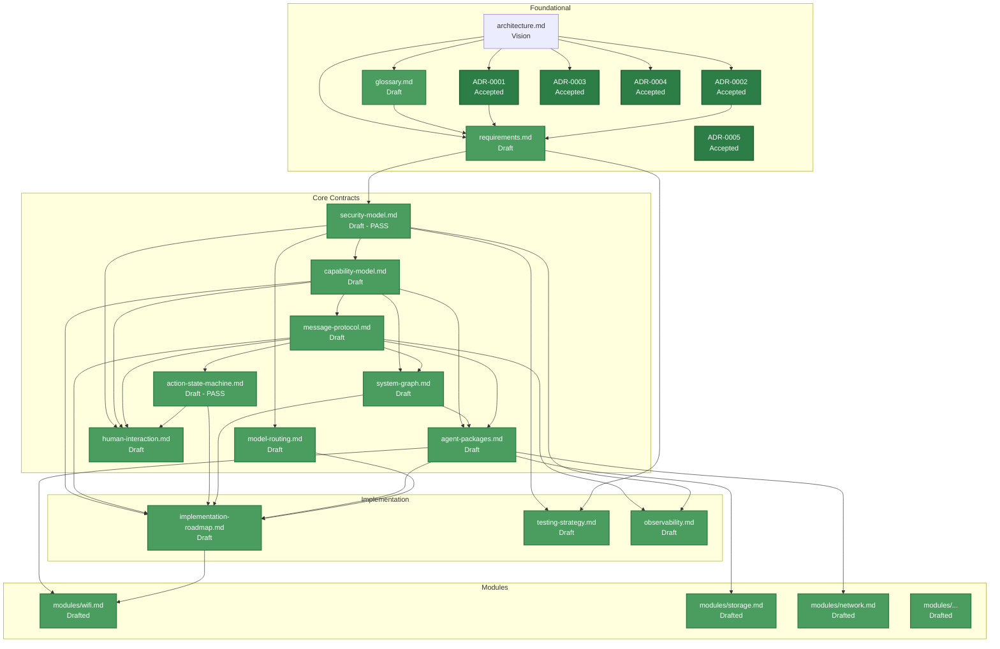

# Aios Documentation Progress

**Status:** Living document  
**Last updated:** 2026-09-04

This document tracks the completion status of the Aios design doc set.
Updated whenever a document's status changes.

## Status Legend

| Marker | Meaning |
|---|---|
| ✅ | Complete — reviewed and accepted |
| 📝 | Drafted — content written, needs review |
| 📋 | Stub — outline exists, content not yet written |
| ❌ | Missing — not yet created |

## Progress Overview

| Document | Status | Completion |
|---|---|---|
| `architecture.md` | Vision | Essay, not contract — contracts are source of truth |
| `glossary.md` | Draft | May need terms as contracts are written |
| `requirements.md` | Draft | May need refinement as contracts expose gaps |
| `decisions/0001-v01-runs-above-linux.md` | ✅ Accepted | 100% |
| `decisions/0002-rust-as-implementation-language.md` | ✅ Accepted | 100% |
| `decisions/0003-fail-fast-no-silent-fallbacks.md` | ✅ Accepted | 100% |
| `decisions/0004-two-dimensional-authorization.md` | ✅ Accepted | 100% |
| `decisions/0005-freeze-triage.md` | ✅ Accepted | 100% |
| `decisions/0006-model-gateway.md` | ✅ Accepted | 100% |
| `decisions/0007-groundless-generation-model.md` | ✅ Accepted | 100% |
| `decisions/0008-workspace-co-partner-branch-and-scope.md` | ✅ Accepted | 100% |
| `decisions/0009-session-day-buckets.md` | ✅ Accepted | 100% |
| `decisions/0010-execution.md` | ✅ Accepted | 100% |
| `decisions/0011-windows-platform.md` | ✅ Accepted | 100% |
| `decisions/0012-live-system-state-and-a2ui-runtime.md` | ✅ Accepted / in progress | Deterministic live-state and unrestricted A2UI architecture; first runtime slice implemented |
| `decisions/0009-session-day-buckets.md` | ✅ Accepted | 100% |
| `decisions/0010-execution.md` | ✅ Accepted | 100% |
| `security-model.md` | Draft — frozen for M1 | Passed adversarial review (round 2) |
| `capability-model.md` | Draft — frozen for M1 | Fixes applied, dead types removed; risk-4 gate aligned with state machine; broker resource-state plumbing noted |
| `message-protocol.md` | Draft — frozen for M1 | Fixes applied; duplicate `Deny` removed, `Escalate`/`Modified` variants dropped, audit-loop termination defined |
| `action-state-machine.md` | Draft — frozen for M1 | Passed adversarial review (round 4) |
| `system-graph.md` | Draft — frozen for M1 | May need refinement during implementation; TTL vs `expires_at` clarified |
| `agent-packages.md` | Draft — frozen for M1 | Mermaid/enum/manifest aligned |
| `model-routing.md` | Draft — updated for M3 | Gateway architecture added (ADR-0006); §6 renumbered |
| `human-interaction.md` | Draft — frozen for M1 | New — consolidates approval/escalation/facade trust; `Modified` decision removed (see message-protocol) |
| `implementation-roadmap.md` | Draft — updated for M11 | M0–M9 complete; M8 shipped incl. 0002 multi-surface + 0003 sidebar admin; M10 session day-buckets and M11 execution primitive in progress on `feature/session-day-buckets` |
| `milestones/0001-generative-surface-desktop-foundation.md` | ✅ Shipped | Desktop foundation live on `main` |
| `milestones/0002-multi-surface-lifecycle-plan.md` | ✅ Shipped at `003f70a` | Multi-surface canvas, per-card drag/close, unioned InputRect. Natural-language edit path is v0.2. |
| `milestones/0003-sidebar-administration-panel.md` | ✅ Shipped | Provider registry, per-role assignment, backend-status rail, settings overlay, ultra-premium visual system. ADR-0010 toggles extend in-place. |
| `milestones/0004-workspace-co-partner.md` | ✅ Complete — merged to `main` at `32ffc0f` | Staged file/web + artifact, `cargo test --lib` 410 |
| `milestones/0005-session-day-buckets.md` | 🔶 In progress on `feature/session-day-buckets` | Toggle UI live; SessionStore persistence + project scaffolding pending. |
| `milestones/0006-live-system-state-a2ui-runtime.md` | 📝 Draft | Collector/state-store migration and durable generative A2UI runtime; no implementation started. |
| `testing-strategy.md` | Draft — frozen for M1 | Test code reconciled with protocol |
| `observability.md` | Draft — frozen for M1 | May need refinement during implementation; retention advisory note and recursive-log-avoidance added |
| `modules/` | 📝 Drafted | 19 of 19 module specs written (wifi, storage, network, drivers, graphics, memory, power-thermal, security, processes, packages, boot-recovery, block-disk, filesystem, files-data, gpu, display, session, bluetooth, wired-lan) |
| `modules/web-fetch.md` | 📋 Stub | Deferred to Stage 3 — fetch/search with DataPolicy provenance |

## Overall Progress

```
Design docs:  17 of 20 frozen or accepted  (85%)
  architecture.md: Vision (essay, not contract)
  glossary.md: Draft
  requirements.md: Draft
  11 focused docs: Draft — frozen for M1
  human-interaction.md: Draft — frozen for M1 (new)
  milestones/0004: Drafted — docs only
Core contracts: 8 of 8 drafted              (100%)
  (SEC, CAP, MSG, ASM, GRAPH, PKG, MODEL, HI)
Human interaction: 1 of 1 drafted           (100%)
ADRs: 11 accepted                            (11 of expected ~15-20)
Module specs: 19 of 19 drafted + 1 stub     (web-fetch stub)
```

Implementation status is tracked in `implementation-roadmap.md` and the
milestone documents. Current:

M0–M9 are **complete on `main`**. All ten M7 specialists (Storage, Network,
Drivers, Graphics, Memory, Power/thermal, Security/identity, Processes,
Packages, Boot/recovery) are wired through the broker. M8 shipped its
foundation (`0001`), multi-surface lifecycle (`0002` at `003f70a`), and the
premium sidebar administration panel (`0003`, incl. provider registry,
per-role model assignment, backend-status rail, settings overlay). M9
(`0004-workspace-co-partner`) merged to `main` at `32ffc0f` with staged
`file:/workspace` + `file:/artifacts` + `web:fetch`.

**In progress on `feature/session-day-buckets`:** M10 (session day-buckets,
SessionStore persistence, `project.scaffold`, always-on awareness) and M11
(execution primitive `exec.run` per ADR-0010, Guardian denylist, approval
modes, verifier toggle, sudoers.d installer). The library baseline on this
branch is 413 passed, 1 ignored (411 at the M9 merge `32ffc0f`; +3 added on
this branch — accounted for in `docs/test-ledger.md`).

## Dependency Graph

The diagram below shows document dependencies and completion status.
Green = drafted/accepted, yellow = stub, red = missing.



## Recommended Drafting Order

The dependency graph defines the order. Each row can only be fully drafted
after the row above it is substantially complete:

```
Row 1 (done):     architecture.md, glossary.md, requirements.md, ADR-0001
Row 2 (done):     security-model.md, ADR-0002, ADR-0003
Row 3 (done):     capability-model.md, ADR-0004
Row 4 (done):     message-protocol.md
Row 5 (done):     action-state-machine.md, system-graph.md, model-routing.md,
                   human-interaction.md, ADR-0005
  → action-state-machine.md done
  → system-graph.md done
  → model-routing.md done
  → human-interaction.md done (freeze pass)
  → ADR-0005 done (freeze triage)
Row 6 (done):     agent-packages.md
  → ADR-0006 done (model gateway — M3 implementation, accepted 2026-08-12)
Row 7 (done):     implementation-roadmap.md, testing-strategy.md, observability.md
Row 8 (done):     modules/wifi.md, modules/storage.md, ... (all 19 module specs
                   drafted; refined as each specialist is implemented)
```

## ADR Log

| # | Title | Status | Date |
|---|---|---|---|
| 0001 | Aios v0.1 runs above Linux in user space | Accepted | 2026-08-09 |
| 0002 | Rust as implementation language | Accepted | 2026-08-09 |
| 0003 | Fail-fast, no silent fallbacks during development | Accepted | 2026-08-09 |
| 0004 | Two-dimensional authorization (capability × tool risk level) | Accepted | 2026-08-09 |
| 0005 | Freeze triage — decided, undeveloped | Accepted | 2026-08-09 |
| 0006 | Universal OpenAI-compatible gateway backend | Accepted | 2026-08-12 |
| 0007 | Groundless generative-surface model controlled by Aios | Accepted | 2026-08-16 |
| 0008 | Workspace co-partner scope and branch rule | Accepted | 2026-08-22 |
| 0009 | Session day-buckets | Accepted | 2026-08-22 |
| 0010 | Typed execution primitive (exec.run) | Accepted | 2026-08-22 |
| 0011 | Windows platform support | Accepted | 2026-08-25 |
| 0009 | Session day-buckets and project persistence | Accepted | 2026-08-22 |
| 0010 | Typed execution primitive and approval modes | Accepted | 2026-08-22 |
