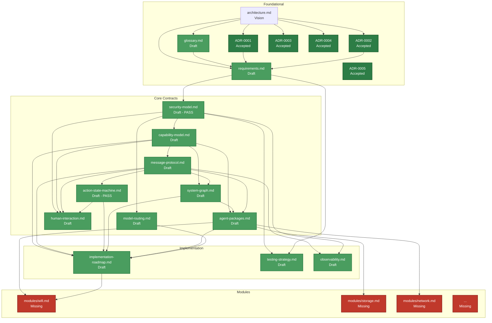

# Aios Documentation Progress

**Status:** Living document  
**Last updated:** 2026-08-09

This document tracks the completion status of the Aios design doc set.
Updated whenever a document's status changes.

## Status Legend

| Marker | Meaning |
|---|---|
| ✅ | Complete — reviewed and accepted |
| 📝 | Drafted — content written, needs review |
| 📋 | Stub — outline exists, content not yet written |
| ❌ | Missing — not yet created |

## Progress Overview

| Document | Status | Completion |
|---|---|---|
| `architecture.md` | Vision | Essay, not contract — contracts are source of truth |
| `glossary.md` | Draft | May need terms as contracts are written |
| `requirements.md` | Draft | May need refinement as contracts expose gaps |
| `decisions/0001-v01-runs-above-linux.md` | ✅ Accepted | 100% |
| `decisions/0002-rust-as-implementation-language.md` | ✅ Accepted | 100% |
| `decisions/0003-fail-fast-no-silent-fallbacks.md` | ✅ Accepted | 100% |
| `decisions/0004-two-dimensional-authorization.md` | ✅ Accepted | 100% |
| `decisions/0005-freeze-triage.md` | ✅ Accepted | 100% |
| `security-model.md` | Draft — frozen for M1 | Passed adversarial review (round 2) |
| `capability-model.md` | Draft — frozen for M1 | Fixes applied, dead types removed; risk-4 gate aligned with state machine; broker resource-state plumbing noted |
| `message-protocol.md` | Draft — frozen for M1 | Fixes applied; duplicate `Deny` removed, `Escalate`/`Modified` variants dropped, audit-loop termination defined |
| `action-state-machine.md` | Draft — frozen for M1 | Passed adversarial review (round 4) |
| `system-graph.md` | Draft — frozen for M1 | May need refinement during implementation; TTL vs `expires_at` clarified |
| `agent-packages.md` | Draft — frozen for M1 | Mermaid/enum/manifest aligned |
| `model-routing.md` | Draft — frozen for M1 | May need refinement during implementation |
| `human-interaction.md` | Draft — frozen for M1 | New — consolidates approval/escalation/facade trust; `Modified` decision removed (see message-protocol) |
| `implementation-roadmap.md` | Draft — frozen for M1 | v0.1 scope clarified for M6 |
| `testing-strategy.md` | Draft — frozen for M1 | Test code reconciled with protocol |
| `observability.md` | Draft — frozen for M1 | May need refinement during implementation; retention advisory note and recursive-log-avoidance added |
| `modules/` | ❌ Empty | 0% — first module created during Wi-Fi specialist work |

## Overall Progress

```
Design docs:  16 of 19 frozen or accepted  (84%)
  architecture.md: Vision (essay, not contract)
  glossary.md: Draft
  requirements.md: Draft
  11 focused docs: Draft — frozen for M1
  human-interaction.md: Draft — frozen for M1 (new)
Core contracts: 8 of 8 drafted              (100%)
  (SEC, CAP, MSG, ASM, GRAPH, PKG, MODEL, HI)
Human interaction: 1 of 1 drafted           (100%)
ADRs: 5 accepted                             (5 of expected ~15-20)
Module specs: 0 of ~10 planned              (0%)
```

## Dependency Graph

The diagram below shows document dependencies and completion status.
Green = drafted/accepted, yellow = stub, red = missing.



## Recommended Drafting Order

The dependency graph defines the order. Each row can only be fully drafted
after the row above it is substantially complete:

```
Row 1 (done):     architecture.md, glossary.md, requirements.md, ADR-0001
Row 2 (done):     security-model.md, ADR-0002, ADR-0003
Row 3 (done):     capability-model.md, ADR-0004
Row 4 (done):     message-protocol.md
Row 5 (done):     action-state-machine.md, system-graph.md, model-routing.md,
                   human-interaction.md, ADR-0005
  → action-state-machine.md done
  → system-graph.md done
  → model-routing.md done
  → human-interaction.md done (freeze pass)
  → ADR-0005 done (freeze triage)
Row 6 (done):     agent-packages.md
Row 7 (done):     implementation-roadmap.md, testing-strategy.md, observability.md
Row 8 (next):     modules/wifi.md, modules/storage.md, ... (one at a time)
```

## ADR Log

| # | Title | Status | Date |
|---|---|---|---|
| 0001 | Aios v0.1 runs above Linux in user space | Accepted | 2026-08-09 |
| 0002 | Rust as implementation language | Accepted | 2026-08-09 |
| 0003 | Fail-fast, no silent fallbacks during development | Accepted | 2026-08-09 |
| 0004 | Two-dimensional authorization (capability × tool risk level) | Accepted | 2026-08-09 |
| 0005 | Freeze triage — decided, undeveloped | Accepted | 2026-08-09 |
