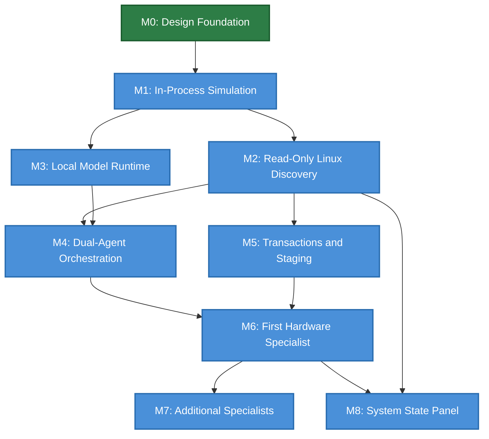

# Aios Implementation Roadmap

**Status:** Draft — frozen for M1  
**Depends on:** architecture.md, requirements.md, security-model.md, capability-model.md, message-protocol.md, action-state-machine.md, system-graph.md, agent-packages.md, model-routing.md, all ADRs

## Purpose

Define concrete milestones, deliverables, acceptance criteria, and dependencies
for the Aios implementation. Synthesizes the workstream order from architecture
section 18 into an actionable plan with estimated effort.

### Planning principles

1. **Each milestone produces a working artifact.** No milestone is complete
   until its acceptance tests pass and the artifact is demonstrable.
2. **Milestones are sequential where dependencies require it, parallel where
   they don't.** The dependency graph determines the order.
3. **Fail-fast applies to milestones too.** If a milestone's tests fail, the
   milestone is not declared complete. No moving forward on a broken
   foundation.
4. **Every milestone includes tests.** Tests are written alongside the code,
   not after. Per the testing strategy, no code lands without tests.
5. **Effort estimates are for a solo developer.** Human review and
   verification are the bottleneck.

---

## Milestone Dependency Graph

---

## Milestone 0: Design Foundation

**Status:** ✅ Complete  
**Estimated effort:** 2–3 weeks  
**Actual effort:** ~1 week

### Deliverables

- [x] `glossary.md` — shared terminology
- [x] `requirements.md` — 32 traceable requirements
- [x] `security-model.md` — threat model, TCB, trust boundaries
- [x] `capability-model.md` — two-dimensional authorization
- [x] `message-protocol.md` — typed internal protocol
- [x] `action-state-machine.md` — transaction and recovery states
- [x] `system-graph.md` — graph specification
- [x] `agent-packages.md` — package manifest and registry
- [x] `model-routing.md` — provider routing and data consent
- [x] ADRs 0001–0004 accepted
- [ ] `testing-strategy.md` — (in progress)
- [ ] `observability.md` — (in progress)
- [ ] `implementation-roadmap.md` — (this document, in progress)

### Acceptance criteria

- All core contract docs reviewed and status set to Draft or Accepted
- ADRs accepted for: v0.1 scope, Rust, fail-fast, two-dimensional auth
- Glossary stable (no terms being redefined)
- Requirements traceable to architecture principles

---

## Milestone 1: In-Process Simulation

**Status:** Not started  
**Estimated effort:** 3–4 weeks  
**Dependencies:** M0 (complete)

### Goal

Build an in-process Rust simulation of the core Aios components with no real
hardware, no Redis, no models. Prove the contracts work when they meet each
other.

### Deliverables

- [ ] `aios::protocol` — message types, envelope, serialization
- [ ] `aios::capability` — principals, capabilities, clearance, tokens
- [ ] `aios::broker` — Policy Broker with decision algorithm
- [ ] `aios::guardian` — Infrastructure Guardian with invariant checks
- [ ] `aios::executor` — Staged Transaction Executor with checkpoints and rollback
- [ ] `aios::graph` — System Graph with node/edge types, query API
- [ ] `aios::action` — Action state machine with persistence
- [ ] Mock Planner agent (sends hardcoded action plans)
- [ ] Mock Verification agent (approves or rejects plans)
- [ ] 2 mock specialists (e.g., mock Wi-Fi, mock storage)
- [ ] Test suite: protocol tests, capability tests, broker tests, Guardian tests, state machine tests, rollback tests

### Acceptance criteria

1. A `ToolRequest` flows from mock Planner → broker → mock specialist →
   `ToolResult` returns to Planner.
2. A request without a valid capability is denied by the broker.
3. A request with insufficient clearance is denied by the broker.
4. The Guardian blocks a critical action (risk level 3) without user approval.
5. A staged action creates a checkpoint, stages a change, and rolls back when
   health check fails.
6. The action state machine persists state and recovers after a simulated
   crash (process restart).
7. The System Graph correctly represents mock devices, agents, and edges.
8. All tests pass. No `unwrap()` in production code paths — errors are
   handled explicitly.

### What this milestone does NOT include

- Real hardware discovery
- Real model inference
- Real Linux API calls
- User interface
- Network communication

---

## Milestone 2: Read-Only Linux Discovery

**Status:** Not started  
**Estimated effort:** 2–3 weeks  
**Dependencies:** M1

### Goal

Replace mock discovery with real Linux hardware discovery. Build the System
Graph from actual udev, sysfs, and procfs data.

### Deliverables

- [ ] `aios::discovery` — udev, sysfs, procfs discovery modules
- [ ] CPU, memory, bus, device, driver, service, filesystem, network, sensor discovery
- [ ] Graph population from discovery results
- [ ] Event-driven graph updates (DeviceAdded, DeviceRemoved, etc.)
- [ ] Reconciliation cycle (periodic re-discovery)
- [ ] Staleness detection and `STALE`/`UNKNOWN` states
- [ ] Basic terminal output showing discovered hardware and graph state
- [ ] Test suite: discovery tests (mock sysfs/procfs), graph population tests, reconciliation tests

### Acceptance criteria

1. Running Aios on a real Linux machine discovers all PCI and USB devices.
2. Discovered devices appear in the System Graph with correct node types and
   attributes.
3. Device dependencies (bus, driver, firmware) are represented as edges.
4. Removing a USB device triggers a `DeviceRemoved` event and graph update.
5. Stale nodes are marked `STALE` after their TTL expires.
6. Reconciliation detects new and removed devices.
7. All tests pass.

---

## Milestone 3: Local Model Runtime

**Status:** Not started  
**Estimated effort:** 2–3 weeks  
**Dependencies:** M1 (can run in parallel with M2)

### Goal

Integrate a local model (Qwen) for offline operation. Build the model
gateway, router, and data classification system.

### Deliverables

- [ ] `aios::model` — model registry, provider tiers, routing
- [ ] Local model integration (Qwen via `llama.cpp` or `mistral.rs` bindings)
- [ ] Connectivity state detection (Offline, LanOnly, Internet)
- [ ] Data classification and consent record system
- [ ] Model health checking
- [ ] Task pinning
- [ ] Fallback behavior (provider failure → task failure → retry on fallback)
- [ ] Test suite: routing tests, consent tests, fallback tests, health tests

### Acceptance criteria

1. Aios can load and run a local Qwen model offline.
2. The model router selects the correct provider based on connectivity state.
3. Data classified as `Secret` is never sent to any model.
4. Data classified as `Protected` is never sent to an internet provider.
5. A provider health failure causes the task to fail (not silently degrade).
6. An active task remains pinned to its provider when connectivity changes.
7. All tests pass.

---

## Milestone 4: Dual-Agent Orchestration

**Status:** Not started  
**Estimated effort:** 4–6 weeks  
**Dependencies:** M2, M3

### Goal

Connect real Planner and Verification agents with safe read-only tools. The
user can ask about hardware and get diagnoses and explanations.

### Deliverables

- [ ] `aios::planner` — Planner agent with model integration
- [ ] `aios::verifier` — Verification agent with model integration
- [ ] `aios::facade` — Conversational facade (terminal-based for v0.1)
- [ ] `aios::coordinator` — Session coordinator
- [ ] Read-only specialist tools (observe, diagnose, query) wired to real
   Linux discovery data
- [ ] Action plan creation and verification flow
- [ ] Audit logging for all agent interactions
- [ ] Test suite: planner tests, verifier tests, end-to-end conversation tests

### Acceptance criteria

1. User types "What's the status of my Wi-Fi?" and gets a coherent response.
2. The Planner creates an action plan with read-only operations.
3. The Verification Agent reviews the plan and returns a verdict.
4. The broker validates capabilities and clearance for each tool request.
5. All interactions are logged in the audit log.
6. The system operates fully offline with a local model.
7. All tests pass.

---

## Milestone 5: Transactions and Staging

**Status:** Not started  
**Estimated effort:** 4–6 weeks  
**Dependencies:** M2

### Goal

Implement the full action state machine with checkpoints, staging, rollback,
and user approval. Enable safe mutations.

### Deliverables

- [ ] Full action state machine implementation (all states and transitions)
- [ ] Checkpoint creation, storage, verification, and cleanup
- [ ] Staged execution (checkpoint → stage → health check → commit/rollback)
- [ ] User approval flow (terminal-based for v0.1)
- [ ] Approval scope checking (plan hash, resource, operation within scope)
- [ ] Crash recovery (write-ahead log, restart recovery)
- [ ] Automatic rollback on health check failure
- [ ] Manual recovery for `Failed` actions
- [ ] Test suite: state machine tests, checkpoint tests, rollback tests, crash recovery tests, approval scope tests

### Acceptance criteria

1. A risk level 2 action creates a checkpoint, stages a change, runs health
   check, and commits if healthy.
2. If the health check fails, the action automatically rolls back to the
   checkpoint.
3. A risk level 3 action requires user approval. Without approval, it is
   denied.
4. An approval with a mismatched plan hash is rejected.
5. A request outside the approval scope is denied.
6. If Aios crashes during staging, the action is recovered on restart
   (rolled back or committed, not left in limbo).
7. If rollback fails, the action enters `Failed` and the user is notified.
8. All tests pass.

---

## Milestone 6: First Hardware Specialist (Wi-Fi)

**Status:** Not started  
**Estimated effort:** 4–6 weeks  
**Dependencies:** M4, M5

### Goal

Build the first real hardware specialist: Wi-Fi. Implement the full
diagnosis-to-recovery scenario from architecture section 12.

### Deliverables

- [ ] `modules/wifi.md` — Wi-Fi specialist specification
- [ ] Wi-Fi specialist package (manifest, tools, tests)
- [ ] Tools: `observe_device`, `diagnose_fault`, `stage_driver`, `request_reset`
- [ ] Wi-Fi-specific health checks
- [ ] Wi-Fi-specific invariants (DRIVER-001, NETWORK-002)
- [ ] Driver staging and rollback for Wi-Fi devices
- [ ] Integration with the System Graph (Wi-Fi device, driver, firmware, bus
   dependencies)
- [ ] Test suite: Wi-Fi discovery tests, diagnosis tests, staging tests,
   rollback tests, hardware-in-the-loop tests (if test hardware available)

### Acceptance criteria

1. Aios discovers a Wi-Fi device and instantiates the Wi-Fi specialist.
2. The user can ask "Why isn't my Wi-Fi working?" and get a diagnosis.
3. The specialist can stage a new driver with module-level checkpoint and rollback.
4. If the staged driver fails health checks, the system rolls back to the
   previous driver module (filesystem/service level, not boot level).
5. A driver reset requires user approval (risk level 4).
6. The Wi-Fi device's dependencies (PCIe, firmware, networkd) are visible in
   the System Graph.
7. All tests pass.

### v0.1 scope note

M6 uses module-level staging and rollback (checkpoint the current driver
module and config, load the new module, health check, commit or restore).
This is consistent with ADR-0001 (v0.1 does not modify the boot chain).
Boot-level rollback (A/B images, watchdog) is deferred to v0.2+.

### This is the first vertical slice

Milestone 6 is the first end-to-end demonstration of Aios: discovery →
agent instantiation → diagnosis → staging → health check → commit/rollback.
It validates the entire architecture against a real hardware scenario.

---

## Milestone 7: Additional Specialists

**Status:** Not started  
**Estimated effort:** 2–4 weeks per specialist  
**Dependencies:** M6

### Goal

Build additional hardware specialists one at a time, following the Wi-Fi
specialist pattern.

### Specialist order (suggested)

| Order | Specialist | Why this order |
|---|---|---|
| 1 | Wi-Fi (M6) | First vertical slice — validates architecture |
| 2 | Storage (NVMe) | Critical for data safety, tests checkpoint/rollback on real hardware |
| 3 | Network (wired) | Pairs with Wi-Fi, tests cross-domain dependencies |
| 4 | Power and thermal | Safety-critical, tests sensor integration |
| 5 | Security and identity | Tests capability model with sensitive resources |
| 6 | Processes and resources | Tests system-level monitoring |
| 7 | Packages and updates | Tests package lifecycle on real packages |
| 8 | Boot and recovery | Tests trust plane integration (v0.2+) |
| 9 | Graphics and user sessions | Lower priority for headless/CLI use case |

### Per-specialist deliverables

- [ ] `modules/<name>.md` — specialist specification
- [ ] Specialist package (manifest, tools, tests)
- [ ] Specialist-specific health checks and invariants
- [ ] Integration tests
- [ ] Module doc in `docs/modules/`

### Per-specialist acceptance criteria

1. The specialist discovers its domain's resources.
2. The specialist exposes bounded tools with correct risk levels.
3. The specialist's capabilities are validated by the broker.
4. Mutating operations go through staging and rollback.
5. The specialist's dependencies are represented in the System Graph.
6. All tests pass.

---

## Milestone 8: System State Panel

**Status:** Not started  
**Estimated effort:** 2–3 weeks  
**Dependencies:** M2 (can run in parallel with M3–M6)

### Goal

Build a dashboard showing overall health, subsystem status, active operations,
model connectivity, and recovery state.

### Deliverables

- [ ] Health and state aggregator
- [ ] System State panel UI (terminal/TUI for v0.1, GUI for v0.2+)
- [ ] Overview view (overall status, subsystem health, connectivity, model route)
- [ ] Subsystem view (detailed metrics, recent events, dependencies, responsible specialist)
- [ ] System Graph view (affected nodes and edges for warnings or proposed changes)
- [ ] Recovery view (snapshots, failed operations, available recovery actions)
- [ ] Audit view (changes, approvals, policy decisions, tool results)
- [ ] Freshness-aware display (`UNKNOWN`/`STALE` states, never silently healthy)
- [ ] Test suite: aggregator tests, display tests, freshness tests

### Acceptance criteria

1. The panel shows real-time health for all discovered subsystems.
2. Stale telemetry appears as `STALE` or `UNKNOWN`, not healthy.
3. Active operations are visible with their current state.
4. The user can see which model provider is active and the connectivity state.
5. Failed actions are visible in the recovery view.
6. All controls that change the system use the same broker/staging/rollback
   path as chat — no privileged bypass.
7. All tests pass.

---

## Timeline Summary

| Milestone | Estimated effort | Cumulative | Dependencies |
|---|---|---|---|
| M0: Design Foundation | ✅ Complete | — | — |
| M1: In-Process Simulation | 3–4 weeks | 3–4 weeks | M0 |
| M2: Read-Only Linux Discovery | 2–3 weeks | 5–7 weeks | M1 |
| M3: Local Model Runtime | 2–3 weeks | 5–7 weeks (parallel) | M1 |
| M4: Dual-Agent Orchestration | 4–6 weeks | 9–13 weeks | M2, M3 |
| M5: Transactions and Staging | 4–6 weeks | 9–13 weeks (parallel with M4) | M2 |
| M6: First Hardware Specialist | 4–6 weeks | 13–19 weeks | M4, M5 |
| M7: Additional Specialists | 2–4 weeks each | +2–4 weeks per specialist | M6 |
| M8: System State Panel | 2–3 weeks | 15–22 weeks (parallel) | M2 |

**Estimated time to working v0.1 with Wi-Fi vertical slice:** 4–5 months  
**Estimated time to full specialist coverage (8 modules):** 8–12 months

---

## Risk Register

| Risk | Likelihood | Impact | Mitigation |
|---|---|---|---|
| M1 contracts don't work together when implemented | Medium | High | M1 is specifically designed to find this — mock simulation before real hardware |
| Local model too slow for useful interaction | Medium | Medium | M3 tests this early; can use smaller model or quantization |
| Linux API complexity slows M2 | Low | Medium | Start with udev/sysfs — both are well-documented |
| Wi-Fi hardware edge cases slow M6 | High | Medium | Expected — this is where design meets reality. Budget extra time. |
| Scope creep in specialist modules | High | High | One specialist at a time. Each has explicit acceptance criteria. |
| Testing bottleneck | Medium | High | Tests written alongside code. No code without tests. |

---

## References

- `docs/architecture.md` — section 18 (design and implementation strategy)
- `docs/decisions/0001-v01-runs-above-linux.md` — v0.1 scope
- `docs/decisions/0002-rust-as-implementation-language.md` — Rust toolchain
- `docs/decisions/0003-fail-fast-no-silent-fallbacks.md` — milestone
  acceptance requires passing tests
- `docs/requirements.md` — all requirements traceable to milestones
- `docs/testing-strategy.md` — testing approach per milestone
