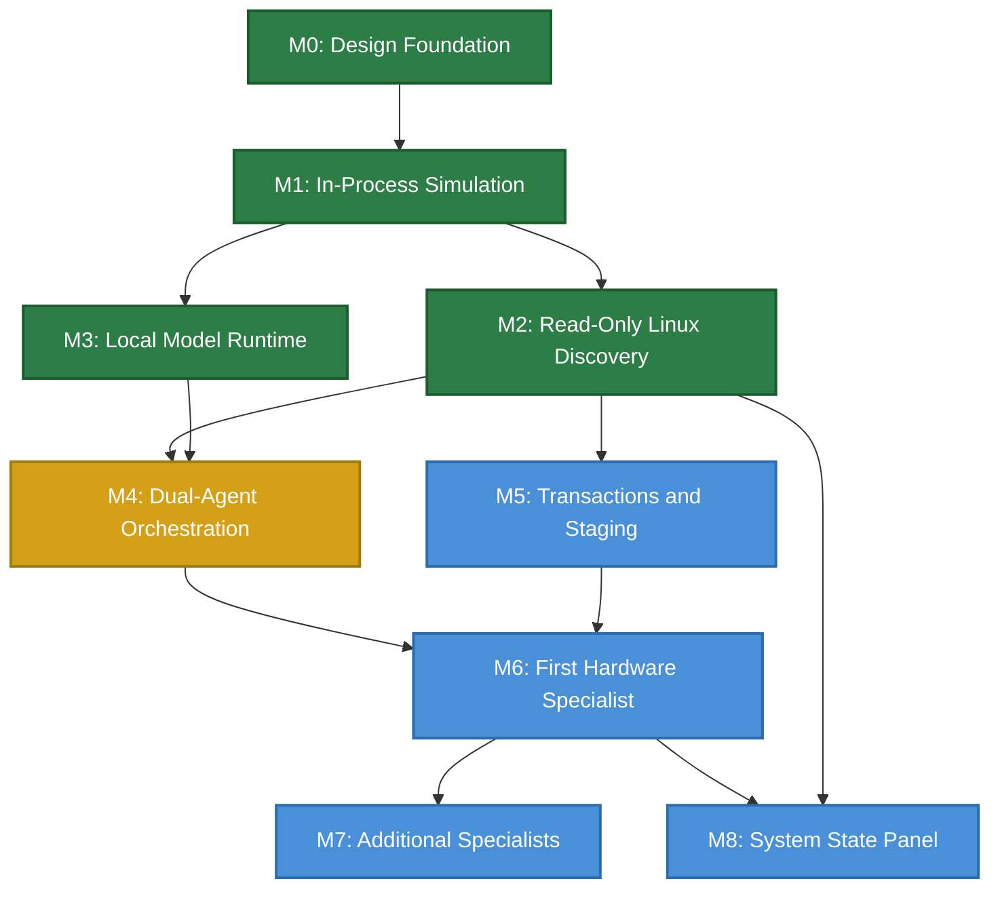

# Aios Implementation Roadmap

**Status:** Draft — updated for M4 (M0–M3 complete, M4 in progress)  
**Depends on:** architecture.md, requirements.md, security-model.md, capability-model.md, message-protocol.md, action-state-machine.md, system-graph.md, agent-packages.md, model-routing.md, all ADRs

## Purpose

Define concrete milestones, deliverables, acceptance criteria, and dependencies
for the Aios implementation. Synthesizes the workstream order from architecture
section 18 into an actionable plan with estimated effort.

### Planning principles

1. **Each milestone produces a working artifact.** No milestone is complete
   until its acceptance tests pass and the artifact is demonstrable.
2. **Milestones are sequential where dependencies require it, parallel where
   they don't.** The dependency graph determines the order.
3. **Fail-fast applies to milestones too.** If a milestone's tests fail, the
   milestone is not declared complete. No moving forward on a broken
   foundation.
4. **Every milestone includes tests.** Tests are written alongside the code,
   not after. Per the testing strategy, no code lands without tests.
5. **Effort estimates are for a solo developer.** Human review and
   verification are the bottleneck.

---

## Milestone Dependency Graph

---

## Milestone 0: Design Foundation

**Status:** ✅ Complete  
**Estimated effort:** 2–3 weeks  
**Actual effort:** ~1 week

### Deliverables

- [x] `glossary.md` — shared terminology
- [x] `requirements.md` — 32 traceable requirements
- [x] `security-model.md` — threat model, TCB, trust boundaries
- [x] `capability-model.md` — two-dimensional authorization
- [x] `message-protocol.md` — typed internal protocol
- [x] `action-state-machine.md` — transaction and recovery states
- [x] `system-graph.md` — graph specification
- [x] `agent-packages.md` — package manifest and registry
- [x] `model-routing.md` — provider routing and data consent
- [x] ADRs 0001–0004 accepted
- [x] `testing-strategy.md`
- [x] `observability.md`
- [x] `implementation-roadmap.md` — (this document)

### Acceptance criteria

- All core contract docs reviewed and status set to Draft or Accepted
- ADRs accepted for: v0.1 scope, Rust, fail-fast, two-dimensional auth
- Glossary stable (no terms being redefined)
- Requirements traceable to architecture principles

---

## Milestone 1: In-Process Simulation

**Status:** ✅ Complete  
**Estimated effort:** 3–4 weeks  
**Dependencies:** M0 (complete)

**Completion note (2026-08-11):** all deliverables are done. The mock
Planner, mock Verification agent, and two mock specialists (Wi-Fi, storage)
live in `aios::mocks`; the demo binary `src/main.rs` drives the full flow:
observe → diagnose → query → verifier review → staged driver commit →
rollback on failed health check → guardian block → approval-gated module
load. 47 tests pass (broker 13, guardian 6, executor 4, action 5, protocol 5,
capability 5, graph 9). Broker runtime methods use `expect()` on mutex locks —
intentional fail-fast under ADR-0003, no silent fallbacks.

### Goal

Build an in-process Rust simulation of the core Aios components with no real
hardware, no Redis, no models. Prove the contracts work when they meet each
other.

### Deliverables

- [x] `aios::protocol` — message types, envelope, serialization
- [x] `aios::capability` — principals, capabilities, clearance, tokens
- [x] `aios::broker` — Policy Broker with decision algorithm
- [x] `aios::guardian` — Infrastructure Guardian with invariant checks
- [x] `aios::executor` — Staged Transaction Executor with checkpoints and rollback
- [x] `aios::graph` — System Graph with node/edge types, query API
- [x] `aios::action` — Action state machine with persistence
- [x] Mock Planner agent (sends hardcoded action plans)
- [x] Mock Verification agent (approves or rejects plans)
- [x] 2 mock specialists (e.g., mock Wi-Fi, mock storage)
- [x] Test suite: protocol, capability, broker, Guardian, state machine,
      rollback, and graph tests written and passing
- [x] Executable entry point (`src/main.rs`) tying the agents to the broker

### Acceptance criteria

1. [x] A `ToolRequest` flows from mock Planner → broker → mock specialist →
   `ToolResult` returns to Planner.
2. [x] A request without a valid capability is denied by the broker.
3. [x] A request with insufficient clearance is denied by the broker.
4. [x] The Guardian blocks a critical action (risk level 3) without user approval.
5. [x] A staged action creates a checkpoint, stages a change, and rolls back when
   health check fails.
6. [x] The action state machine persists state and recovers after a simulated
   crash (process restart).
7. [x] The System Graph correctly represents mock devices, agents, and edges.
8. [x] All tests pass. No `unwrap()` in production code paths — errors are
   handled explicitly. *(lock `expect()`s remain as intentional fail-fast per
   ADR-0003)*

### What this milestone does NOT include

- Real hardware discovery
- Real model inference
- Real Linux API calls
- User interface
- Network communication

### Carried forward from M1

These items were deliberately left loose in the simulation and need a decision
before they become real:

- **The broker hands out capability tokens on demand.** `capability_tokens()`
  is a convenience for `MockPlanner`. The real planner should present tokens
  issued at session start, not pull them from the broker. Settle the handshake
  when real planner-broker messaging lands.
- **Action store and audit log are in-memory.** Fine for a simulation; needs a
  durable store before anything runs long-lived. Revisit with the executor
  persistence work.
- **Post-change health check is a driver flag.** The executor trusts whatever
  the driver reports. Define the health-check contract (what is measured, who
  reports, timeouts) with the specialists.
- **Guardian driver verification is seeded by hand.** The demo just tells the
  guardian "iwlwifi-next is tested". Real verification needs a source of truth
  (package metadata, test logs).

### Resolved during M1 wrap-up

- **Graph single-owner rule now enforced.** `add_edge` rejects a second `owns`
  edge on a resource; `get_owner` is still first-match as a fallback. Spec
  `system-graph.md` 2.3 holds.
- **Duplicate logical edges: allowed by design.** Parallel edges between the
  same pair are legitimate when provenance differs (e.g., a Declared and an
  Observed edge). The `edge_id` key is the differentiator; the model stays.

---

## Milestone 2: Read-Only Linux Discovery

**Status:** ✅ Complete  
**Estimated effort:** 2–3 weeks  
**Dependencies:** M1

**Completion note (2026-08-11):** `aios::discovery` reads the real system —
sysfs/procfs for kernel, CPU, memory, network, PCI, USB, block, driver,
filesystem, and hwmon sensors; `ServiceDiscovery` parses `systemctl` for live
service state. The reconciliation cycle re-scans and diffs the graph, emitting
`DeviceAdded`/`DeviceRemoved` events and cleaning up dangling edges. Verified
on a real machine: 489 nodes (75 services, 24 sensors, 75 devices, 20 CPUs).
58 tests pass. Real-time udev push (sub-second, via libudev) is deferred —
reconciliation polling detects removals at the next cycle; firmware nodes come
with the Wi-Fi specialist in M6.

### Goal

Replace mock discovery with real Linux hardware discovery. Build the System
Graph from actual udev, sysfs, and procfs data.

### Deliverables

- [x] `aios::discovery` — sysfs/procfs scanner, graph population, hardware report
- [x] Event detection via reconciliation diff (`DeviceAdded`/`DeviceRemoved`)
      — real-time udev push deferred
- [x] CPU, memory, bus, device, driver, filesystem, network discovery
- [x] Service discovery (systemctl output parsing)
- [x] Sensor discovery (sysfs hwmon)
- [x] Graph population from discovery results
- [x] Event-driven graph updates via reconciliation
- [x] Reconciliation cycle (re-scan, diff, event emission, dangling-edge cleanup)
- [x] Staleness detection — discovered nodes carry `expires_at` TTL and can be
      marked `STALE` via `SystemGraph::mark_stale`
- [x] Basic terminal output showing discovered hardware and graph state
- [x] Test suite: discovery tests (mock sysfs/procfs), graph population tests,
      reconciliation tests

### Acceptance criteria

1. [x] Running Aios on a real Linux machine discovers all PCI and USB devices.
2. [x] Discovered devices appear in the System Graph with correct node types and
   attributes.
3. [x] Device dependencies (bus, driver, firmware) are represented as edges.
   *(bus and driver edges in M2; firmware nodes deferred to M6)*
4. [x] Removing a USB device triggers a `DeviceRemoved` event and graph update.
   *(detected at the next reconciliation cycle; real-time push deferred)*
5. [x] Stale nodes are marked `STALE` after their TTL expires.
6. [x] Reconciliation detects new and removed devices.
7. [x] All tests pass.

---

## Milestone 3: Local Model Runtime

**Status:** ✅ Complete  
**Estimated effort:** 2–3 weeks  
**Dependencies:** M1 (can run in parallel with M2)

**Completion note (2026-08-12):** `aios::model` implements the registry,
router, gateway, pinner, and `ModelBackend` trait; `aios::local` runs a real
Qwen GGUF through `llama.cpp`; `aios::hub` verifies the model on disk by
SHA-256. Verified end-to-end on a real model
(`qwen2.5-4b-instruct-q4_k_m`) with the ignored `loads_and_generates_real_model`
test — full offline generation through the gateway. 96 tests (95 pass, 1
ignored requires `AIOS_MODEL_PATH`); model 24, local 3, hub 11 added in M3.
The config loader and the OpenAI-compatible `HttpBackend` are specified
(ADR-0006) but deferred to M4.

### Goal

Integrate a local model (Qwen) for offline operation. Build the model
gateway, router, and data classification system.

### Deliverables

- [x] `aios::model` — model registry, provider tiers, routing, gateway,
      pinner, backend trait
- [x] Local model integration (Qwen via `llama.cpp`/`llama-cpp-2` bindings)
- [x] Connectivity state detection (Offline, LanOnly, Internet)
- [x] Data classification and consent record system
- [x] Model health checking
- [x] Task pinning
- [x] Fallback behavior (provider failure → task failure → retry on fallback)
- [x] `aios::hub` — model metadata, SHA-256 verification of the on-disk model
- [x] Test suite: routing tests, consent tests, fallback tests, health tests

### Acceptance criteria

1. [x] Aios can load and run a local Qwen model offline. *(verified with the
   real-model integration test)*
2. [x] The model router selects the correct provider based on connectivity state.
3. [x] Data classified as `Secret` is never sent to any model.
4. [x] Data classified as `Protected` is never sent to an internet provider.
5. [x] A provider health failure causes the task to fail (not silently degrade).
6. [x] An active task remains pinned to its provider when connectivity changes.
7. [x] All tests pass.

### Carried forward from M3

- **Config-driven providers.** Providers are currently built in code
  (`ProviderId::Local`); the `~/.aios/` config that declares providers,
  tiers, and endpoints is specified in ADR-0006 and lands with the
  `HttpBackend`.
- **OpenAI-compatible `HttpBackend`.** The universal remote backend
  (model-routing.md §6.3, ADR-0006) is deferred to M4.
- **`aios::hub` install flow.** The baseline Qwen model ships with Aios and
  is verified on disk by SHA-256 at first use; it is never downloaded at
  runtime (offline mode has no network). The setup command that provisions
  the model into `~/.aios/models/` comes with the config work. Model
  download is only for optional additional models while online, and only
  with explicit user action.

---

## Milestone 4: Dual-Agent Orchestration

**Status:** ✅ Complete (local-only shell performance deferred)
**Estimated effort:** 4–6 weeks  
**Dependencies:** M2, M3

**Progress note (2026-08-12):** the conversational foundation is in place and
working offline on the real local model. `aios::config` loads `~/.aios/config.toml`
(providers as `[[provider]]` entries); `aios::http` implements the
OpenAI-compatible `HttpBackend` from ADR-0006, so any OpenAI-compatible
provider (OpenAI, DeepSeek, OpenRouter, Kimi, Ollama) is a config change, not
code. `aios::coordinator` boots the gateway from config and probes connectivity;
`aios::planner` and `aios::verifier` run the real model with structured JSON
prompts; `aios::facade` is the interactive `aios shell` (status, scan,
providers, consent, plan, model, chat). Read-only specialist tools
(`aios::tools`: observe, diagnose, query, deps, impact, health) run against
the live discovery graph, and `aios::audit` logs every interaction to
`~/.aios/audit.log`. Verified on the real machine with OpenAI, OpenRouter and
Kimi wired in: the shell scans 491 nodes, observes the Wi-Fi interface,
and chats through the cloud provider when online. Boot discovery now populates
the graph before the first chat; using Aios establishes session consent for
machine state, with revoke still available, and shell chat supports a bounded
read-only tool loop with audit records. Live-system questions now fail closed
when the Planner emits no executable tool call; sensor and memory data are
included in the graph context. The OpenAI-compatible backend now advertises
the bounded read-only tools and accepts native tool-call responses. A manual
GPU-temperature question completed a tool-call round trip and returned a
grounded response. Native tool calls, denied tool calls, and their audit
entries were verified manually against the configured provider. M4 now rejects
staged and critical plan steps before verification because mutations belong to
M5. 191 tests pass, with the real-model test passing when
`AIOS_MODEL_PATH` points at the provisioned model. The local-only shell run
with the full discovery context is deferred as a performance investigation;
the local model runtime remains verified. M4 is complete for the configured
cloud path. Planner/verifier parsing is balanced and string-aware, and
malformed staged or critical M4 plans fail before review. The local-only shell
performance investigation is explicitly deferred to a later local-runtime
work item.

### Goal

Connect real Planner and Verification agents with safe read-only tools. The
user can ask about hardware and get diagnoses and explanations.

### Interaction boundary

The user-facing experience is conversational. The user asks a question in
ordinary language and receives one conversational Aios response. Tool names,
arguments, capability tokens, broker decisions, and intermediate tool results
are internal protocol traffic; they are not presented as the conversation.
The Planner may request bounded read-only tools, the broker validates and
routes those requests, and the final response is composed from the returned
evidence. The facade may expose explicit diagnostic commands for inspection,
but it does not authorize actions or replace the conversational path.

### Deliverables

- [x] `aios::planner` — Planner agent with model integration
- [x] `aios::verifier` — Verification agent with model integration
- [x] `aios::facade` — Conversational facade (terminal-based for v0.1)
- [x] `aios::coordinator` — Session coordinator
- [x] `aios::config` + `aios::http` — config-driven providers and
      OpenAI-compatible `HttpBackend` (ADR-0006)
- [x] Read-only specialist tools (observe, diagnose, query) wired to real
   Linux discovery data
- [x] Action plan creation and verification flow (planner → verifier, JSON
      parsing with freeform fallback)
- [x] Audit logging for all agent interactions
- [x] Test suite: planner tests, verifier tests, end-to-end conversation tests

### Acceptance criteria

1. [x] User types "What's the status of my Wi-Fi?" and gets a coherent response.
2. [x] The Planner creates an action plan with read-only operations.
3. [x] The Verification Agent reviews the plan and returns a verdict.
4. [x] The broker validates capabilities and clearance for each tool request.
5. [x] All interactions are logged in the audit log.
6. [deferred] Fully offline shell operation with the local model; local model
   runtime is verified, but full-discovery shell performance is deferred.
7. [x] All tests pass.

---

## Milestone 5: Transactions and Staging

**Status:** ✅ Complete
**Estimated effort:** 4–6 weeks  
**Dependencies:** M2

**Progress note (2026-08-12):** the existing action state machine and staged
executor now persist checkpoints separately from action records, verify them
before staging, clean them up after commit or rollback, retain them after
failure, and fail visibly on recovery-store errors. Fault tests cover health
errors, checkpoint verification failure, rollback failure, and restart
recovery. Broker approval tests cover missing approval, plan-hash mismatch,
and scope mismatch. The standalone broker demo was manually verified through
commit, automatic rollback, Guardian denial, approved mutation, and audit
output. Broker-to-executor tests now cover healthy risk-2 commit and unhealthy
automatic rollback. The broker-owned approval channel rejects non-user
responses, rejects expired or declined requests, and creates approvals only
inside the broker. Failed actions retain their checkpoints and expose an
explicit user-invoked manual recovery operation. The full suite passes with
200 tests, 199 passing and 1 ignored.

### Goal

Implement the full action state machine with checkpoints, staging, rollback,
and user approval. Enable safe mutations.

### Deliverables

- [x] Full action state machine implementation (all states and transitions)
- [x] Checkpoint creation, storage, verification, and cleanup
- [x] Staged execution (checkpoint → stage → health check → commit/rollback)
- [x] User approval flow (terminal-based for v0.1)
- [x] Approval scope checking (plan hash, resource, operation within scope)
- [x] Crash recovery (write-ahead log, restart recovery)
- [x] Automatic rollback on health check failure
- [x] Manual recovery for `Failed` actions
- [x] Test suite: state machine tests, checkpoint tests, rollback tests, crash recovery tests, approval scope tests

### Acceptance criteria

1. [x] A risk level 2 action creates a checkpoint, stages a change, runs health
   check, and commits if healthy.
2. [x] If the health check fails, the action automatically rolls back to the
   checkpoint.
3. [x] A risk level 3 action requires user approval. Without approval, it is
   denied.
4. [x] An approval with a mismatched plan hash is rejected.
5. [x] A request outside the approval scope is denied.
6. [x] If Aios crashes during staging, the action is recovered on restart
   (rolled back or committed, not left in limbo).
7. [x] If rollback fails, the action enters `Failed` and the user is notified.
8. [x] All tests pass.

---

## Milestone 6: First Hardware Specialist (Wi-Fi)

**Status:** In progress
**Estimated effort:** 4–6 weeks  
**Dependencies:** M4, M5

**Progress note (2026-08-12):** the Wi-Fi package specification and manifest
are present. Boot discovery now identifies an unambiguous wireless controller,
instantiates `wifi.specialist`, and records its ownership in the System Graph.
The specialist declares bounded observe, diagnose, staged-driver, and reset
tools with the documented risk levels, and reports driver, bus, and network
service dependency health from graph evidence. Seeded graph tests and a live
shell boot confirm discovery and instantiation. Driver staging, reset approval,
and live Wi-Fi-specific health verification remain to be implemented.

### Goal

Build the first real hardware specialist: Wi-Fi. Implement the full
diagnosis-to-recovery scenario from architecture section 12.

### Deliverables

- [ ] `modules/wifi.md` — Wi-Fi specialist specification
- [ ] Wi-Fi specialist package (manifest, tools, tests)
- [ ] Tools: `observe_device`, `diagnose_fault`, `stage_driver`, `request_reset`
- [ ] Wi-Fi-specific health checks
- [ ] Wi-Fi-specific invariants (DRIVER-001, NETWORK-002)
- [ ] Driver staging and rollback for Wi-Fi devices
- [ ] Integration with the System Graph (Wi-Fi device, driver, firmware, bus
   dependencies)
- [ ] Test suite: Wi-Fi discovery tests, diagnosis tests, staging tests,
   rollback tests, hardware-in-the-loop tests (if test hardware available)

### Acceptance criteria

1. Aios discovers a Wi-Fi device and instantiates the Wi-Fi specialist.
2. The user can ask "Why isn't my Wi-Fi working?" and get a diagnosis.
3. The specialist can stage a new driver with module-level checkpoint and rollback.
4. If the staged driver fails health checks, the system rolls back to the
   previous driver module (filesystem/service level, not boot level).
5. A driver reset requires user approval (risk level 4).
6. The Wi-Fi device's dependencies (PCIe, firmware, networkd) are visible in
   the System Graph.
7. All tests pass.

### v0.1 scope note

M6 uses module-level staging and rollback (checkpoint the current driver
module and config, load the new module, health check, commit or restore).
This is consistent with ADR-0001 (v0.1 does not modify the boot chain).
Boot-level rollback (A/B images, watchdog) is deferred to v0.2+.

### This is the first vertical slice

Milestone 6 is the first end-to-end demonstration of Aios: discovery →
agent instantiation → diagnosis → staging → health check → commit/rollback.
It validates the entire architecture against a real hardware scenario.

---

## Milestone 7: Additional Specialists

**Status:** Not started  
**Estimated effort:** 2–4 weeks per specialist  
**Dependencies:** M6

### Goal

Build additional hardware specialists one at a time, following the Wi-Fi
specialist pattern.

### Specialist order (suggested)

| Order | Specialist | Why this order |
|---|---|---|
| 1 | Wi-Fi (M6) | First vertical slice — validates architecture |
| 2 | Storage (NVMe) | Critical for data safety, tests checkpoint/rollback on real hardware |
| 3 | Network (wired) | Pairs with Wi-Fi, tests cross-domain dependencies |
| 4 | Power and thermal | Safety-critical, tests sensor integration |
| 5 | Security and identity | Tests capability model with sensitive resources |
| 6 | Processes and resources | Tests system-level monitoring |
| 7 | Packages and updates | Tests package lifecycle on real packages |
| 8 | Boot and recovery | Tests trust plane integration (v0.2+) |
| 9 | Graphics and user sessions | Lower priority for headless/CLI use case |

### Per-specialist deliverables

- [ ] `modules/<name>.md` — specialist specification
- [ ] Specialist package (manifest, tools, tests)
- [ ] Specialist-specific health checks and invariants
- [ ] Integration tests
- [ ] Module doc in `docs/modules/`

### Per-specialist acceptance criteria

1. The specialist discovers its domain's resources.
2. The specialist exposes bounded tools with correct risk levels.
3. The specialist's capabilities are validated by the broker.
4. Mutating operations go through staging and rollback.
5. The specialist's dependencies are represented in the System Graph.
6. All tests pass.

---

## Milestone 8: System State Panel

**Status:** Not started  
**Estimated effort:** 2–3 weeks  
**Dependencies:** M2 (can run in parallel with M3–M6)

### Goal

Build a dashboard showing overall health, subsystem status, active operations,
model connectivity, and recovery state.

### Deliverables

- [ ] Health and state aggregator
- [ ] System State panel UI (terminal/TUI for v0.1, GUI for v0.2+)
- [ ] Overview view (overall status, subsystem health, connectivity, model route)
- [ ] Subsystem view (detailed metrics, recent events, dependencies, responsible specialist)
- [ ] System Graph view (affected nodes and edges for warnings or proposed changes)
- [ ] Recovery view (snapshots, failed operations, available recovery actions)
- [ ] Audit view (changes, approvals, policy decisions, tool results)
- [ ] Freshness-aware display (`UNKNOWN`/`STALE` states, never silently healthy)
- [ ] Test suite: aggregator tests, display tests, freshness tests

### Acceptance criteria

1. The panel shows real-time health for all discovered subsystems.
2. Stale telemetry appears as `STALE` or `UNKNOWN`, not healthy.
3. Active operations are visible with their current state.
4. The user can see which model provider is active and the connectivity state.
5. Failed actions are visible in the recovery view.
6. All controls that change the system use the same broker/staging/rollback
   path as chat — no privileged bypass.
7. All tests pass.

---

## Timeline Summary

| Milestone | Estimated effort | Cumulative | Dependencies |
|---|---|---|---|
| M0: Design Foundation | ✅ Complete | — | — |
| M1: In-Process Simulation | ✅ Complete | 3–4 weeks | M0 |
| M2: Read-Only Linux Discovery | ✅ Complete | 2–3 weeks | M1 |
| M3: Local Model Runtime | ✅ Complete | 5–7 weeks (parallel) | M1 |
| M4: Dual-Agent Orchestration | ✅ Complete (offline shell deferred) | 9–13 weeks | M2, M3 |
| M5: Transactions and Staging | ✅ Complete | 9–13 weeks (parallel with M4) | M2 |
| M6: First Hardware Specialist | In progress | 13–19 weeks | M4, M5 |
| M7: Additional Specialists | 2–4 weeks each | +2–4 weeks per specialist | M6 |
| M8: System State Panel | 2–3 weeks | 15–22 weeks (parallel) | M2 |

**Estimated time to working v0.1 with Wi-Fi vertical slice:** 4–5 months  
**Estimated time to full specialist coverage (8 modules):** 8–12 months

---

## Risk Register

| Risk | Likelihood | Impact | Mitigation |
|---|---|---|---|
| M1 contracts don't work together when implemented | Medium | High | M1 is specifically designed to find this — mock simulation before real hardware |
| Local model too slow for useful interaction | Medium | Medium | M3 tests this early; can use smaller model or quantization |
| Linux API complexity slows M2 | Low | Medium | Start with udev/sysfs — both are well-documented |
| Wi-Fi hardware edge cases slow M6 | High | Medium | Expected — this is where design meets reality. Budget extra time. |
| Scope creep in specialist modules | High | High | One specialist at a time. Each has explicit acceptance criteria. |
| Testing bottleneck | Medium | High | Tests written alongside code. No code without tests. |

---

## References

- `docs/architecture.md` — section 18 (design and implementation strategy)
- `docs/decisions/0001-v01-runs-above-linux.md` — v0.1 scope
- `docs/decisions/0002-rust-as-implementation-language.md` — Rust toolchain
- `docs/decisions/0003-fail-fast-no-silent-fallbacks.md` — milestone
  acceptance requires passing tests
- `docs/requirements.md` — all requirements traceable to milestones
- `docs/testing-strategy.md` — testing approach per milestone
