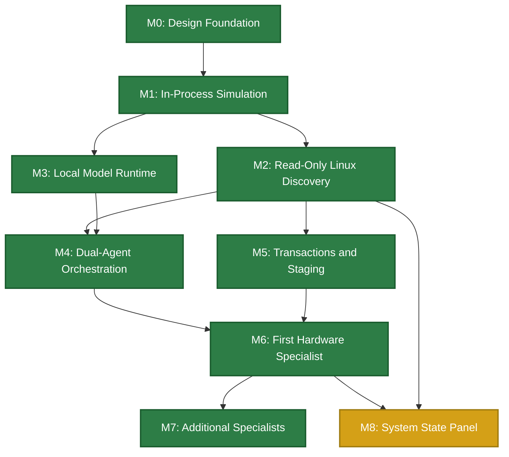

# Aios Implementation Roadmap

**Status:** Draft — updated for M7 (M0–M7 complete, M8 terminal panel and
resident docked UI complete, with the dynamic generative surface
(model-selected, validated widget composition) still to land, tracked in
`docs/ui.md` and `docs/m8-ui-repair-plan.md`)  
**Depends on:** architecture.md, requirements.md, security-model.md, capability-model.md, message-protocol.md, action-state-machine.md, system-graph.md, agent-packages.md, model-routing.md, all ADRs

## Purpose

Define concrete milestones, deliverables, acceptance criteria, and dependencies
for the Aios implementation. Synthesizes the workstream order from architecture
section 18 into an actionable plan with estimated effort.

### Planning principles

1. **Each milestone produces a working artifact.** No milestone is complete
   until its acceptance tests pass and the artifact is demonstrable.
2. **Milestones are sequential where dependencies require it, parallel where
   they don't.** The dependency graph determines the order.
3. **Fail-fast applies to milestones too.** If a milestone's tests fail, the
   milestone is not declared complete. No moving forward on a broken
   foundation.
4. **Every milestone includes tests.** Tests are written alongside the code,
   not after. Per the testing strategy, no code lands without tests.
5. **Effort estimates are for a solo developer.** Human review and
   verification are the bottleneck.

---

## Milestone Dependency Graph

---

## Milestone 0: Design Foundation

**Status:** ✅ Complete  
**Estimated effort:** 2–3 weeks  
**Actual effort:** ~1 week

### Deliverables

- [x] `glossary.md` — shared terminology
- [x] `requirements.md` — 32 traceable requirements
- [x] `security-model.md` — threat model, TCB, trust boundaries
- [x] `capability-model.md` — two-dimensional authorization
- [x] `message-protocol.md` — typed internal protocol
- [x] `action-state-machine.md` — transaction and recovery states
- [x] `system-graph.md` — graph specification
- [x] `agent-packages.md` — package manifest and registry
- [x] `model-routing.md` — provider routing and data consent
- [x] ADRs 0001–0004 accepted
- [x] `testing-strategy.md`
- [x] `observability.md`
- [x] `implementation-roadmap.md` — (this document)

### Acceptance criteria

- All core contract docs reviewed and status set to Draft or Accepted
- ADRs accepted for: v0.1 scope, Rust, fail-fast, two-dimensional auth
- Glossary stable (no terms being redefined)
- Requirements traceable to architecture principles

---

## Milestone 1: In-Process Simulation

**Status:** ✅ Complete  
**Estimated effort:** 3–4 weeks  
**Dependencies:** M0 (complete)

**Completion note (2026-08-11):** all deliverables are done. The mock
Planner, mock Verification agent, and two mock specialists (Wi-Fi, storage)
live in `aios::mocks`; the demo binary `src/main.rs` drives the full flow:
observe → diagnose → query → verifier review → staged driver commit →
rollback on failed health check → guardian block → approval-gated module
load. 47 tests pass (broker 13, guardian 6, executor 4, action 5, protocol 5,
capability 5, graph 9). Broker runtime methods use `expect()` on mutex locks —
intentional fail-fast under ADR-0003, no silent fallbacks.

### Goal

Build an in-process Rust simulation of the core Aios components with no real
hardware, no Redis, no models. Prove the contracts work when they meet each
other.

### Deliverables

- [x] `aios::protocol` — message types, envelope, serialization
- [x] `aios::capability` — principals, capabilities, clearance, tokens
- [x] `aios::broker` — Policy Broker with decision algorithm
- [x] `aios::guardian` — Infrastructure Guardian with invariant checks
- [x] `aios::executor` — Staged Transaction Executor with checkpoints and rollback
- [x] `aios::graph` — System Graph with node/edge types, query API
- [x] `aios::action` — Action state machine with persistence
- [x] Mock Planner agent (sends hardcoded action plans)
- [x] Mock Verification agent (approves or rejects plans)
- [x] 2 mock specialists (e.g., mock Wi-Fi, mock storage)
- [x] Test suite: protocol, capability, broker, Guardian, state machine,
      rollback, and graph tests written and passing
- [x] Executable entry point (`src/main.rs`) tying the agents to the broker

### Acceptance criteria

1. [x] A `ToolRequest` flows from mock Planner → broker → mock specialist →
   `ToolResult` returns to Planner.
2. [x] A request without a valid capability is denied by the broker.
3. [x] A request with insufficient clearance is denied by the broker.
4. [x] The Guardian blocks a critical action (risk level 3) without user approval.
5. [x] A staged action creates a checkpoint, stages a change, and rolls back when
   health check fails.
6. [x] The action state machine persists state and recovers after a simulated
   crash (process restart).
7. [x] The System Graph correctly represents mock devices, agents, and edges.
8. [x] All tests pass. No `unwrap()` in production code paths — errors are
   handled explicitly. *(lock `expect()`s remain as intentional fail-fast per
   ADR-0003)*

### What this milestone does NOT include

- Real hardware discovery
- Real model inference
- Real Linux API calls
- User interface
- Network communication

### Carried forward from M1

These items were deliberately left loose in the simulation and need a decision
before they become real:

- **The broker hands out capability tokens on demand.** `capability_tokens()`
  is a convenience for `MockPlanner`. The real planner should present tokens
  issued at session start, not pull them from the broker. Settle the handshake
  when real planner-broker messaging lands.
- **Action store and audit log are in-memory.** Fine for a simulation; needs a
  durable store before anything runs long-lived. Revisit with the executor
  persistence work.
- **Post-change health check is a driver flag.** The executor trusts whatever
  the driver reports. Define the health-check contract (what is measured, who
  reports, timeouts) with the specialists.
- **Guardian driver verification is seeded by hand.** The demo just tells the
  guardian "iwlwifi-next is tested". Real verification needs a source of truth
  (package metadata, test logs).

### Resolved during M1 wrap-up

- **Graph single-owner rule now enforced.** `add_edge` rejects a second `owns`
  edge on a resource; `get_owner` is still first-match as a fallback. Spec
  `system-graph.md` 2.3 holds.
- **Duplicate logical edges: allowed by design.** Parallel edges between the
  same pair are legitimate when provenance differs (e.g., a Declared and an
  Observed edge). The `edge_id` key is the differentiator; the model stays.

---

## Milestone 2: Read-Only Linux Discovery

**Status:** ✅ Complete  
**Estimated effort:** 2–3 weeks  
**Dependencies:** M1

**Completion note (2026-08-11):** `aios::discovery` reads the real system —
sysfs/procfs for kernel, CPU, memory, network, PCI, USB, block, driver,
filesystem, and hwmon sensors; `ServiceDiscovery` parses `systemctl` for live
service state. The reconciliation cycle re-scans and diffs the graph, emitting
`DeviceAdded`/`DeviceRemoved` events and cleaning up dangling edges. Verified
on a real machine: 489 nodes (75 services, 24 sensors, 75 devices, 20 CPUs).
58 tests pass. Real-time udev push (sub-second, via libudev) is deferred —
reconciliation polling detects removals at the next cycle; firmware nodes come
with the Wi-Fi specialist in M6.

### Goal

Replace mock discovery with real Linux hardware discovery. Build the System
Graph from actual udev, sysfs, and procfs data.

### Deliverables

- [x] `aios::discovery` — sysfs/procfs scanner, graph population, hardware report
- [x] Event detection via reconciliation diff (`DeviceAdded`/`DeviceRemoved`)
      — real-time udev push deferred
- [x] CPU, memory, bus, device, driver, filesystem, network discovery
- [x] Service discovery (systemctl output parsing)
- [x] Sensor discovery (sysfs hwmon)
- [x] Graph population from discovery results
- [x] Event-driven graph updates via reconciliation
- [x] Reconciliation cycle (re-scan, diff, event emission, dangling-edge cleanup)
- [x] Staleness detection — discovered nodes carry `expires_at` TTL and can be
      marked `STALE` via `SystemGraph::mark_stale`
- [x] Basic terminal output showing discovered hardware and graph state
- [x] Test suite: discovery tests (mock sysfs/procfs), graph population tests,
      reconciliation tests

### Acceptance criteria

1. [x] Running Aios on a real Linux machine discovers all PCI and USB devices.
2. [x] Discovered devices appear in the System Graph with correct node types and
   attributes.
3. [x] Device dependencies (bus, driver, firmware) are represented as edges.
   *(bus and driver edges in M2; firmware nodes deferred to M6)*
4. [x] Removing a USB device triggers a `DeviceRemoved` event and graph update.
   *(detected at the next reconciliation cycle; real-time push deferred)*
5. [x] Stale nodes are marked `STALE` after their TTL expires.
6. [x] Reconciliation detects new and removed devices.
7. [x] All tests pass.

---

## Milestone 3: Local Model Runtime

**Status:** ✅ Complete  
**Estimated effort:** 2–3 weeks  
**Dependencies:** M1 (can run in parallel with M2)

**Completion note (2026-08-12):** `aios::model` implements the registry,
router, gateway, pinner, and `ModelBackend` trait; `aios::local` runs a real
Qwen GGUF through `llama.cpp`; `aios::hub` verifies the model on disk by
SHA-256. Verified end-to-end on a real model
(`qwen2.5-4b-instruct-q4_k_m`) with the ignored `loads_and_generates_real_model`
test — full offline generation through the gateway. 96 tests (95 pass, 1
ignored requires `AIOS_MODEL_PATH`); model 24, local 3, hub 11 added in M3.
The config loader and the OpenAI-compatible `HttpBackend` are specified
(ADR-0006) but deferred to M4.

### Goal

Integrate a local model (Qwen) for offline operation. Build the model
gateway, router, and data classification system.

### Deliverables

- [x] `aios::model` — model registry, provider tiers, routing, gateway,
      pinner, backend trait
- [x] Local model integration (Qwen via `llama.cpp`/`llama-cpp-2` bindings)
- [x] Connectivity state detection (Offline, LanOnly, Internet)
- [x] Data classification and consent record system
- [x] Model health checking
- [x] Task pinning
- [x] Fallback behavior (provider failure → task failure → retry on fallback)
- [x] `aios::hub` — model metadata, SHA-256 verification of the on-disk model
- [x] Test suite: routing tests, consent tests, fallback tests, health tests

### Acceptance criteria

1. [x] Aios can load and run a local Qwen model offline. *(verified with the
   real-model integration test)*
2. [x] The model router selects the correct provider based on connectivity state.
3. [x] Data classified as `Secret` is never sent to any model.
4. [x] Data classified as `Protected` is never sent to an internet provider.
5. [x] A provider health failure causes the task to fail (not silently degrade).
6. [x] An active task remains pinned to its provider when connectivity changes.
7. [x] All tests pass.

### Carried forward from M3

- **Config-driven providers.** Providers are currently built in code
  (`ProviderId::Local`); the `~/.aios/` config that declares providers,
  tiers, and endpoints is specified in ADR-0006 and lands with the
  `HttpBackend`.
- **OpenAI-compatible `HttpBackend`.** The universal remote backend
  (model-routing.md §6.3, ADR-0006) is deferred to M4.
- **`aios::hub` install flow.** The baseline Qwen model ships with Aios and
  is verified on disk by SHA-256 at first use; it is never downloaded at
  runtime (offline mode has no network). The setup command that provisions
  the model into `~/.aios/models/` comes with the config work. Model
  download is only for optional additional models while online, and only
  with explicit user action.

---

## Milestone 4: Dual-Agent Orchestration

**Status:** ✅ Complete (local-only shell performance deferred)
**Estimated effort:** 4–6 weeks  
**Dependencies:** M2, M3

**Progress note (2026-08-12):** the conversational foundation is in place and
working offline on the real local model. `aios::config` loads `~/.aios/config.toml`
(providers as `[[provider]]` entries); `aios::http` implements the
OpenAI-compatible `HttpBackend` from ADR-0006, so any OpenAI-compatible
provider (OpenAI, DeepSeek, OpenRouter, Kimi, Ollama) is a config change, not
code. `aios::coordinator` boots the gateway from config and probes connectivity;
`aios::planner` and `aios::verifier` run the real model with structured JSON
prompts; `aios::facade` is the interactive `aios shell` (status, scan,
providers, consent, plan, model, chat). Read-only specialist tools
(`aios::tools`: observe, diagnose, query, deps, impact, health) run against
the live discovery graph, and `aios::audit` logs every interaction to
`~/.aios/audit.log`. Verified on the real machine with OpenAI, OpenRouter and
Kimi wired in: the shell scans 491 nodes, observes the Wi-Fi interface,
and chats through the cloud provider when online. Boot discovery now populates
the graph before the first chat; using Aios establishes session consent for
machine state, with revoke still available, and shell chat supports a bounded
read-only tool loop with audit records. Live-system questions now fail closed
when the Planner emits no executable tool call; sensor and memory data are
included in the graph context. The OpenAI-compatible backend now advertises
the bounded read-only tools and accepts native tool-call responses. A manual
GPU-temperature question completed a tool-call round trip and returned a
grounded response. Native tool calls, denied tool calls, and their audit
entries were verified manually against the configured provider. M4 now rejects
staged and critical plan steps before verification because mutations belong to
M5. 191 tests pass, with the real-model test passing when
`AIOS_MODEL_PATH` points at the provisioned model. The local-only shell run
with the full discovery context is deferred as a performance investigation;
the local model runtime remains verified. M4 is complete for the configured
cloud path. Planner/verifier parsing is balanced and string-aware, and
malformed staged or critical M4 plans fail before review. The local-only shell
performance investigation is explicitly deferred to a later local-runtime
work item.

### Goal

Connect real Planner and Verification agents with safe read-only tools. The
user can ask about hardware and get diagnoses and explanations.

### Interaction boundary

The user-facing experience is conversational. The user asks a question in
ordinary language and receives one conversational Aios response. Tool names,
arguments, capability tokens, broker decisions, and intermediate tool results
are internal protocol traffic; they are not presented as the conversation.
The Planner may request bounded read-only tools, the broker validates and
routes those requests, and the final response is composed from the returned
evidence. The facade may expose explicit diagnostic commands for inspection,
but it does not authorize actions or replace the conversational path.

### Deliverables

- [x] `aios::planner` — Planner agent with model integration
- [x] `aios::verifier` — Verification agent with model integration
- [x] `aios::facade` — Conversational facade (terminal-based for v0.1)
- [x] `aios::coordinator` — Session coordinator
- [x] `aios::config` + `aios::http` — config-driven providers and
      OpenAI-compatible `HttpBackend` (ADR-0006)
- [x] Read-only specialist tools (observe, diagnose, query) wired to real
   Linux discovery data
- [x] Action plan creation and verification flow (planner → verifier, JSON
      parsing with freeform fallback)
- [x] Audit logging for all agent interactions
- [x] Test suite: planner tests, verifier tests, end-to-end conversation tests

### Acceptance criteria

1. [x] User types "What's the status of my Wi-Fi?" and gets a coherent response.
2. [x] The Planner creates an action plan with read-only operations.
3. [x] The Verification Agent reviews the plan and returns a verdict.
4. [x] The broker validates capabilities and clearance for each tool request.
5. [x] All interactions are logged in the audit log.
6. [deferred] Fully offline shell operation with the local model; local model
   runtime is verified, but full-discovery shell performance is deferred.
7. [x] All tests pass.

---

## Milestone 5: Transactions and Staging

**Status:** ✅ Complete
**Estimated effort:** 4–6 weeks  
**Dependencies:** M2

**Progress note (2026-08-12):** the existing action state machine and staged
executor now persist checkpoints separately from action records, verify them
before staging, clean them up after commit or rollback, retain them after
failure, and fail visibly on recovery-store errors. Fault tests cover health
errors, checkpoint verification failure, rollback failure, and restart
recovery. Broker approval tests cover missing approval, plan-hash mismatch,
and scope mismatch. The standalone broker demo was manually verified through
commit, automatic rollback, Guardian denial, approved mutation, and audit
output. Broker-to-executor tests now cover healthy risk-2 commit and unhealthy
automatic rollback. The broker-owned approval channel rejects non-user
responses, rejects expired or declined requests, and creates approvals only
inside the broker. Failed actions retain their checkpoints and expose an
explicit user-invoked manual recovery operation. The full suite passes with
200 tests, 199 passing and 1 ignored.

### Goal

Implement the full action state machine with checkpoints, staging, rollback,
and user approval. Enable safe mutations.

### Deliverables

- [x] Full action state machine implementation (all states and transitions)
- [x] Checkpoint creation, storage, verification, and cleanup
- [x] Staged execution (checkpoint → stage → health check → commit/rollback)
- [x] User approval flow (terminal-based for v0.1)
- [x] Approval scope checking (plan hash, resource, operation within scope)
- [x] Crash recovery (write-ahead log, restart recovery)
- [x] Automatic rollback on health check failure
- [x] Manual recovery for `Failed` actions
- [x] Test suite: state machine tests, checkpoint tests, rollback tests, crash recovery tests, approval scope tests

### Acceptance criteria

1. [x] A risk level 2 action creates a checkpoint, stages a change, runs health
   check, and commits if healthy.
2. [x] If the health check fails, the action automatically rolls back to the
   checkpoint.
3. [x] A risk level 3 action requires user approval. Without approval, it is
   denied.
4. [x] An approval with a mismatched plan hash is rejected.
5. [x] A request outside the approval scope is denied.
6. [x] If Aios crashes during staging, the action is recovered on restart
   (rolled back or committed, not left in limbo).
7. [x] If rollback fails, the action enters `Failed` and the user is notified.
8. [x] All tests pass.

---

## Milestone 6: First Hardware Specialist (Wi-Fi)

**Status:** ✅ Complete
**Estimated effort:** 4–6 weeks  
**Dependencies:** M4, M5

**Progress note (2026-08-12):** the Wi-Fi package specification and manifest
are present. Boot discovery now identifies an unambiguous wireless controller,
instantiates `wifi.specialist`, and records its ownership in the System Graph.
The specialist declares bounded observe, diagnose, staged-driver, and reset
tools with the documented risk levels, and reports driver, bus, and network
service dependency health from graph evidence. Seeded graph tests and a live
shell boot confirm discovery and instantiation. Driver staging, reset approval,
and live Wi-Fi-specific health verification remain to be implemented.

**Progress note (2026-08-12, later):** firmware discovery landed. `aios::discovery`
now probes every PCI/USB device directory for a generic set of standard sysfs
firmware attributes and walks the kernel firmware class, creating
`firmware:<name>` nodes and `depends_on` edges from device to firmware. Nothing
is assumed about any specific driver or system: a device with no readable
firmware attribute simply has no firmware node, which closes the M2 carry-forward
("firmware nodes come with the Wi-Fi specialist in M6") and covers acceptance
criterion #6 wherever the environment exposes the data. 229 tests pass. Driver
staging, reset approval, live health verification, and the end-to-end vertical
slice test remain.

**Progress note (2026-08-12, final):** the end-to-end vertical slice now runs
through the boot-wired coordinator. Coordinator-level tests drive the broker
into the staged executor for all four wifi flows: healthy risk-2 `stage_driver`
commits, unhealthy staging auto-rolls back (`ToolStatus::RolledBack` with
`HealthCheckFailed`), risk-4 `request_reset` is denied without a broker-owned
approval, and a reset commits after the facade's own approval channel
(`issue_reset_approval` → `submit_approval`) records it. Live Wi-Fi health
verification landed with `LinuxDriverControl`: the active module, module
version, and carrier/operstate link state are read from real sysfs, mutations
are planned (`modprobe ...`) and only executed when the control is explicitly
opted in — the default stays dry-run so Aios never touches the running kernel
(safety boundary: real module changes are executed by the user on the
wired-connected machine). Setting `AIOS_LIVE_DRIVER_CONTROL` at boot switches
the executor to the live control while keeping all tests hermetic against the
mock. 239 tests pass.

### Goal

Build the first real hardware specialist: Wi-Fi. Implement the full
diagnosis-to-recovery scenario from architecture section 12.

### Deliverables

- [x] `modules/wifi.md` — Wi-Fi specialist specification
- [x] Wi-Fi specialist package (manifest, tools, tests)
- [x] Tools: `observe_device`, `diagnose_fault`, `stage_driver`, `request_reset`
- [x] Wi-Fi-specific health checks
- [x] Wi-Fi-specific invariants (DRIVER-001, NETWORK-002)
- [x] Driver staging and rollback for Wi-Fi devices
- [x] Integration with the System Graph (Wi-Fi device, driver, firmware, bus
   dependencies)
- [x] Test suite: Wi-Fi discovery tests, diagnosis tests, staging tests,
   rollback tests, hardware-in-the-loop tests (if test hardware available) —
   unit coverage exists; the coordinator-level vertical slice covers stage
   commit, stage rollback, reset approval denial, and reset approval commit
   through the broker and boot-wired executor

### Acceptance criteria

1. [x] Aios discovers a Wi-Fi device and instantiates the Wi-Fi specialist.
2. [x] The user can ask "Why isn't my Wi-Fi working?" and get a diagnosis.
3. [x] The specialist can stage a new driver with module-level checkpoint and rollback.
4. [x] If the staged driver fails health checks, the system rolls back to the
   previous driver module (filesystem/service level, not boot level).
5. [x] A driver reset requires user approval (risk level 4) — broker enforces
   it; the end-to-end test through the wifi tool runs at the coordinator level
   (denied without approval, commits through the facade approval channel).
6. [x] The Wi-Fi device's dependencies (PCIe, firmware, networkd) are visible in
   the System Graph.
7. [x] All tests pass (239).

### v0.1 scope note

M6 uses module-level staging and rollback (checkpoint the current driver
module and config, load the new module, health check, commit or restore).
This is consistent with ADR-0001 (v0.1 does not modify the boot chain).
Boot-level rollback (A/B images, watchdog) is deferred to v0.2+.

### This is the first vertical slice

Milestone 6 is the first end-to-end demonstration of Aios: discovery →
agent instantiation → diagnosis → staging → health check → commit/rollback.
It validates the entire architecture against a real hardware scenario.

---

## Milestone 7: Additional Specialists

**Status:** ✅ Complete
**Estimated effort:** 2–4 weeks per specialist
**Dependencies:** M6

**Progress note (2026-08-12):** the Storage umbrella specialist is wired
through the boot path. `aios::storage` discovers block devices and mounted
filesystems from the live graph and instantiates when either exists
(`StorageError::NoStorageResources` fails closed otherwise). The umbrella
owns every discovered block device and mounted filesystem via `owns` edges,
and declares the read-only tools `storage.observe_storage` and
`storage.diagnose_fault` (docs/modules/storage.md: observe capacity, health,
and cross-layer state; diagnose compares observations against invariants
STORAGE-001/002). Coordinator boot registers the tools with the broker,
spawns the specialist handlers, grants the session principal read-only
capabilities on `storage:domain`, and routes `run_tool_as` calls for the
storage tools to that resource (message-protocol §8.1, capability-model §3.3)
exactly like the wifi read-only tools. The agent tool instructions
(`aios::tools`) advertise the storage tools so the planner can discover them.
Coordinator-level tests drive broker → specialist for observe and diagnose
(hermetic `wire_storage` helper seeds a block device when the machine has
none). Verified live: the system panel shows the Storage specialist owning
the Device and Filesystem subsystems, and a real model chat session called
`storage.observe_storage` through the broker and reported the live domain
state. 256 tests pass. Files/Data child and any mutating storage operations
(partitioning, formatting, reset) are deferred per ADR-0001 (v0.1 is
filesystem/service-level only).

**Progress note (2026-08-12, network):** the Network umbrella specialist
follows the same pattern (`aios::network`, docs/modules/network.md). It
discovers the wired/LAN interfaces (`device:net-*` excluding wireless) and
bluetooth controllers left unclaimed by transport children, and instantiates
when either exists (`NetworkError::NoNetworkResources` fails closed
otherwise). Wireless interfaces stay owned by the Wi-Fi specialist — the
umbrella skips any resource that already has an owner (one-owner rule,
architecture §5). It declares the read-only tools `network.observe_network`
and `network.diagnose_fault` on the `network:domain` resource (invariants
NETWORK-001: the domain is present and reports connectivity; NETWORK-002:
transport link state after a staged change, deferred with mutations).
Coordinator boot registers the tools with the broker, spawns the specialist
handlers, grants the session principal the read-only capabilities, and
routes `run_tool_as` calls for the network tools to `network:domain`
exactly like the wifi and storage read-only tools. Coordinator-level tests
drive broker → specialist for observe and diagnose (hermetic `wire_network`
helper seeds wired and bluetooth nodes when the machine has none). Verified
live: the system panel shows the Network specialist owning the Device
subsystem alongside Wi-Fi and Storage, and a real model chat session called
`network.observe_network` through the broker and reported the live link
state (3 wired interfaces: docker0 unknown, enx00051b2bfd34 healthy,
lo unknown). 267 tests pass. Wired-LAN and Bluetooth as first-class
transport child specialists, and any mutating network operations, are
deferred to later iterations.

**Progress note (2026-08-12, drivers):** the Drivers and hardware specialist
follows the same pattern (`aios::drivers`, docs/modules/drivers.md) as a
peer of the domain specialists. It discovers the unclaimed PCI/USB hardware
inventory, firmware nodes, and loaded kernel modules — block devices stay
with Storage, wireless controllers with the Wi-Fi specialist, wired
interfaces with the Network umbrella; anything already owned is skipped
(one-owner rule, architecture §5). It declares the read-only tools
`drivers.observe_device` and `drivers.diagnose_fault` on the
`drivers:domain` resource (invariant DRIVER-001: the active driver is
present and attached to the discovered device; DEVICE-002 belongs to the
mutation pass). Coordinator boot registers the tools with the broker,
spawns the specialist handlers, grants the session principal the read-only
capabilities, and routes `run_tool_as` calls for the drivers tools to
`drivers:domain` exactly like the other specialist read-only tools.
Coordinator-level tests drive broker → specialist for observe and diagnose
(hermetic `wire_drivers` helper seeds a PCI device, firmware, and driver
when the machine has none). Verified live: the system panel shows the
Drivers specialist owning generic hardware alongside the domain
specialists, and a real model chat session called `drivers.observe_device`
through the broker and reported the live hardware state (31 unclaimed
devices, 17 with attached drivers, no firmware). 278 tests pass.
`stage_driver` and `request_reset`, which will reuse the staged-executor
path the wifi tools already use, are deferred to the mutation pass.

**Progress note (2026-08-12, graphics):** the Graphics umbrella specialist
follows the same pattern (`aios::graphics`, docs/modules/graphics.md). It
owns the graphics and session domain: GPUs (structural PCI display-controller
class `0x03`, or a self-identifying GPU), displays and the display service,
and user/desktop sessions. It instantiates when any of these exist
(`GraphicsError::NoGraphicsResources` fails closed otherwise). The drivers
peer now excludes GPU-class devices so they stay unclaimed for the graphics
domain (one-owner rule, architecture §5). It declares the read-only tools
`graphics.observe_graphics` and `graphics.diagnose_fault` on the
`graphics:domain` resource (invariant GFX-001: the GPU is present and
reports state; GFX-002 belongs to the mutation pass). Coordinator boot
registers the tools with the broker, spawns the specialist handlers, grants
the session principal the read-only capabilities, and routes `run_tool_as`
calls for the graphics tools to `graphics:domain` exactly like the other
specialist read-only tools. Coordinator-level tests drive broker →
specialist for observe and diagnose (hermetic `wire_graphics` helper seeds a
GPU when the machine has none). 290 tests pass. Display configuration, GPU
reset, and any mutating graphics operations are deferred to the mutation
pass.

**Progress note (2026-08-12, memory):** the Memory umbrella specialist
follows the same pattern (`aios::memory`, docs/modules/memory.md). It owns
the memory domain: physical memory nodes (`memory:total`,
`memory:available`, discovered with a `size_kb` capacity attribute) and ECC
sensors. It instantiates when any of these exist
(`MemoryError::NoMemoryResources` fails closed otherwise). It declares the
read-only tools `memory.observe_memory` and `memory.diagnose_fault` on the
`memory:domain` resource (invariant MEMORY-001: the memory subsystem is
present and reports usable capacity; MEMORY-002 belongs to the mutation
pass). Coordinator boot registers the tools with the broker, spawns the
specialist handlers, grants the session principal the read-only
capabilities, and routes `run_tool_as` calls for the memory tools to
`memory:domain` exactly like the other specialist read-only tools.
Coordinator-level tests drive broker → specialist for observe and diagnose
(hermetic `wire_memory` helper seeds a memory node when the machine has
none). 301 tests pass. `stage_policy` and `request_reset`, which will reuse
the staged-executor path the wifi tools already use, are deferred to the
mutation pass.

**Progress note (2026-08-12, power/thermal):** the Power and thermal umbrella
specialist follows the same pattern (`aios::power`,
docs/modules/power-thermal.md). It owns the power and thermal domain:
temperature and fan sensors (`sensor:*` nodes from `sys/class/hwmon` whose
kind is `temp*`/`fan*`) and power sensors (`in*`/`energy*`/`power*`/`curr*`).
ECC/memory sensors stay with the memory specialist (one-owner rule,
architecture §5). It instantiates when any of these exist
(`PowerError::NoPowerResources` fails closed otherwise). It declares the
read-only tools `power.observe_thermal` and `power.diagnose_fault` on the
`power:domain` resource (invariant THERMAL-001: temperature sensors are
present and report within limits; THERMAL-002 belongs to the mutation pass).
Coordinator boot registers the tools with the broker, spawns the specialist
handlers, grants the session principal the read-only capabilities, and routes
`run_tool_as` calls for the power tools to `power:domain` exactly like the
other specialist read-only tools. Coordinator-level tests drive broker →
specialist for observe and diagnose (hermetic `wire_power` helper seeds a
thermal sensor when the machine has none). 312 tests pass. Bounded workload
changes (throttling, fan curves) and any mutating power operations are
deferred to the mutation pass.

**Progress note (2026-08-12, security/identity):** the Security and identity
umbrella specialist follows the same pattern (`aios::security`,
docs/modules/security.md), with one difference: its domain is the enforcement
plane — the Guardian, capabilities, and policies — which always exists rather
than being sysfs-discovered. Boot seeds those nodes in the graph
(`seed_security_domain`: `guardian:0`, `capability:session`, `policy:broker`,
mirroring how discovery populates hardware nodes) so the specialist can own
them. It declares the read-only tools `security.observe_security` and
`security.diagnose_fault` on the `security:domain` resource (invariant
SEC-001: identity and trust boundaries are present and verified; SEC-002
belongs to the mutation pass). Coordinator boot registers the tools with the
broker, spawns the specialist handlers, grants the session principal the
read-only capabilities, and routes `run_tool_as` calls for the security tools
to `security:domain` exactly like the other specialist read-only tools.
Coordinator-level tests drive broker → specialist for observe and diagnose
(hermetic `wire_security` helper seeds the enforcement-plane nodes). 323
tests pass. `quarantine` (risk 4, the bounded containment response) and any
mutating security operations are deferred to the mutation pass.

**Progress note (2026-08-13, processes):** the Processes and resources
 specialist follows the same pattern (`aios::processes`,
 docs/modules/processes.md). It owns the process domain: `process:<pid>`
 nodes discovered from `/proc` (pid, comm, state, rss_kb attributes) and
 reports CPU utilization sampled from `/proc/stat`. It instantiates when
 any process nodes exist (`ProcessesError::NoProcessResources` fails closed
 otherwise). It declares the read-only tools `processes.observe_process`
 and `processes.diagnose_fault` on the `processes:domain` resource
 (invariant PROC-001: processes are present and report resource usage;
 PROC-002 belongs to the mutation pass). Coordinator boot registers the
 tools with the broker, spawns the specialist handlers, grants the session
 principal read-only capabilities on `processes:domain`, and routes
 `run_tool_as` calls for the processes tools to that resource.
 Coordinator-level tests drive broker → specialist for observe and
 diagnose (hermetic `wire_processes` helper seeds a process node when the
 machine has none). Stopping processes and resource-limit changes are
 deferred to the mutation pass, and resource budget enforcement stays
 advisory in v0.1 (REQ-PERF-002).

**Progress note (2026-08-13, processes CPU depth):** a follow-up made
 `observe_process` answer "which processes use the CPU" instead of just
 reporting a system-wide number. Discovery now reads the utime/stime tick
 counters from `/proc/<pid>/stat`, the full command line from
 `/proc/<pid>/cmdline`, and derives per-process health from the state char
 (running/sleeping healthy, zombie/stopped/disk-wait degraded). The
 specialist samples the system and per-process tick counters twice across a
 short window and reports system CPU utilization, core count, and the top
 processes by CPU percent (pid, comm, cpu percent, rss, state, command
 line), or per-pid rows when the target names a specific process. The
 misleading per-domain `nodes_with_usage` metric key and the every-pid
 `resources` list were replaced with clearer output. The full suite passes
 at 359 tests.

**Progress note (2026-08-13, packages):** the Packages and updates
specialist follows the same pattern (`aios::packages`,
docs/modules/packages.md). It discovers package resources as
`package:<name>` nodes (NodeType::Package) with `version`,
`signature`, and `state` attributes. It instantiates when any
package nodes exist (`PackagesError::NoPackageResources` fails
closed otherwise). It declares the read-only tools
`packages.observe_package` and `packages.diagnose_fault` on the
`packages:domain` resource (invariants PKG-001: packages are
present, signed, and versioned; PKG-002 belongs to the mutation
pass). Coordinator boot registers the tools with the broker,
spawns the specialist handlers, grants the session principal
read-only capabilities on `packages:domain`, and routes
`run_tool_as` calls for the packages tools to that resource.
Coordinator-level tests drive broker → specialist for observe and
diagnose (hermetic `wire_packages` helper seeds a package node
when the machine has none). 359 tests pass. `stage_update`
(risk 2) and `request_rollback` (risk 4) are deferred to the
mutation pass.

**Progress note (2026-08-13, boot/recovery):** the Boot and
recovery specialist follows the same pattern (`aios::boot`,
docs/modules/boot-recovery.md), with one difference: its domain
is the trust plane — boot images, snapshots, and watchdogs —
which is seeded by the coordinator rather than sysfs-discovered
(mirroring how the security specialist seeds enforcement-plane
nodes). Boot seeds `BootImage`, `Snapshot`, and `Watchdog` nodes
in the graph (`seed_boot_domain`) so the specialist can own
them. It declares the read-only tools `boot.observe_boot` and
`boot.diagnose_fault` on the `boot:domain` resource (invariant
BOOT-001: a known-good recovery image is available; BOOT-002
belongs to the mutation pass). Coordinator boot registers the
tools with the broker, spawns the specialist handlers, grants the
session principal read-only capabilities on `boot:domain`, and
routes `run_tool_as` calls for the boot tools to that resource.
Coordinator-level tests drive broker → specialist for observe and
diagnose (hermetic `wire_boot_recovery` helper seeds the
trust-plane nodes). 359 tests pass. Boot-level mutating
operations (A/B image management, watchdogs) are deferred to
v0.2+ per ADR-0001.

### Storage specialist: complete

The per-specialist acceptance criteria (below) are met for Storage: it
discovers its domain (recorded boot instantiation plus seeded-graph tests),
exposes bounded read-only tools with risk level 0, its capabilities are
validated by the broker (observe and diagnose run through `run_tool_as` →
broker → specialist and are denied without a session token), its
dependencies are represented in the System Graph (`owns` on every block
device and filesystem, `depends_on` stack edges from filesystem to device
to bus/driver). The mutating-operations criterion is deferred to a later
iteration per ADR-0001 (v0.1 is read-only for storage).

### Goal

Build additional hardware specialists one at a time, following the Wi-Fi
specialist pattern.

### Specialist order (suggested)

| Order | Specialist | Why this order |
|---|---|---|
| 1 | Wi-Fi (M6) | First vertical slice — validates architecture |
| 2 | Storage (umbrella) | Critical for data safety, tests checkpoint/rollback on real hardware; Block/Disk, Filesystem, and Files/Data are stacked children (architecture §6) |
| 3 | Network (umbrella) | Owns the network domain; Wi-Fi, wired/LAN, and Bluetooth are transport children (architecture §6 hierarchy) |
| 4 | Drivers and hardware | Peer domain that owns generic PCI/USB inventory, firmware, and module state; domain specialists own their devices (architecture §5) |
| 5 | Graphics (umbrella) | GPU is second only to CPU in hardware importance; GPU, Display, and Session are stacked children (architecture §6) |
| 6 | Memory | Architecture §5 lists it but the earlier order omitted it; ECC errors, pressure, swap, OOM are a real domain with real invariants |
| 7 | Power and thermal | Safety-critical, tests sensor integration |
| 8 | Security and identity | Tests capability model with sensitive resources |
| 9 | Processes and resources | Tests system-level monitoring |
| 10 | Packages and updates | Tests package lifecycle on real packages |
| 11 | Boot and recovery | Tests trust plane integration (v0.2+) |

Graphics is ranked with the core hardware specialists: the GPU is second only
to the CPU in hardware importance, and Aios is not headless — it has a
first-class UI (see `docs/ui.md`). The Graphics umbrella (with GPU, Display,
and Session children) is a hardware specialist; it is separate from the Aios
UI itself (docs/ui.md), which is an interface-layer concern.

The Network umbrella owns the network domain. Its transport children each own
their resource class: Wi-Fi owns wireless interfaces, Wired/LAN owns ethernet
interfaces, Bluetooth owns bluetooth controllers. Ownership is still
per-resource (each interface has exactly one owner); the hierarchy is for
organization and delegation (architecture §6).

The Storage umbrella owns the storage domain. Its children are a stack, not
parallel transports: Block/Disk owns block devices, Filesystem owns mounted
filesystems, Files/Data owns file-level operations. A file lives on a
filesystem, which lives on a block device; the dependency graph captures the
stack (architecture §6).

The Graphics umbrella owns the graphics and session domain. Its children are
a stack: Session owns user/desktop sessions, Display owns monitors and the
display service, GPU owns the graphics processing unit. A session runs on a
display, which renders on a GPU; the dependency graph captures the stack
(architecture §6). The Graphics hardware specialists are separate from the
Aios UI (docs/ui.md), which is an interface-layer concern.

Drivers and hardware is a peer of the domain specialists, not their parent. It
owns the generic PCI/USB inventory, firmware, and module state that no domain
specialist owns. It may implement driver staging, but bound to the devices it
owns; it does not stage drivers for devices owned by another specialist
(architecture §5 one-owner-per-resource).

### Ownership map

Before adding specialists, define the ownership map: which resource classes map
to which specialist, with no overlaps and no orphans. Every resource has exactly
one owning specialist (architecture §5); two agents must not independently
control the same resource. The map is what "full coverage" actually means — it
catches boundary problems like a Bluetooth controller being miscounted as a
second Wi-Fi device. The map lives in `docs/system-graph.md` and is refined as
each specialist is built.

### Per-specialist deliverables

- [x] `modules/<name>.md` — specialist specification
- [x] Specialist package (tools, tests; `modules/wifi/manifest.toml` is the
      only shipped manifest — the M7 specialists declare their tools in code
      and are wired by the coordinator)
- [x] Specialist-specific health checks and invariants
- [x] Integration tests
- [x] Module doc in `docs/modules/`

### Per-specialist acceptance criteria

1. The specialist discovers its domain's resources.
2. The specialist exposes bounded tools with correct risk levels.
3. The specialist's capabilities are validated by the broker.
4. Mutating operations go through staging and rollback.
5. The specialist's dependencies are represented in the System Graph.
6. All tests pass.

---

## Milestone 8: System State Panel and Aios UI

**Status:** ✅ Terminal panel complete (terminal `panel` command). The
resident docked UI (sidebar and canvas windows, GTK layer-shell dock) is
implemented and launchable via `npm run tauri:dev`. The dynamic generative
surface — model-selected, validated widget composition — is the remaining
work and is tracked in `docs/ui.md` and `docs/m8-ui-repair-plan.md`  
**Estimated effort:** 2–3 weeks (panel); the full UI (presence, screen space,
screen vision) is a larger workstream tracked in `docs/ui.md`  
**Dependencies:** M2 (can run in parallel with M3–M6)

### Goal

Build the System State panel showing overall health, subsystem status, active
operations, model connectivity, and recovery state, as one part of the Aios
UI. The full UI is larger than the panel: Aios is always present on the
screen, occupies a sidebar with other windows reflowing around it, and has
tools to see the screen. The full UI design is scoped in `docs/ui.md` and is
its own workstream; the panel is the first concrete piece.

### Deliverables

- [x] Health and state aggregator (`src/panel.rs`, snapshot of route,
  connectivity, graph health, active operations, recovery, audit)
- [x] System State panel UI (resident Tauri docked UI: sidebar and canvas
      windows); dynamic widget composition still to land, see `docs/ui.md`
- [x] Overview view (overall status, subsystem health, connectivity, model route)
- [x] Subsystem view (per-subsystem health rollup, attention count,
      dependency count, responsible specialist; attention-first ordering)
- [x] System Graph view (affected nodes for warnings or proposed changes)
- [x] Recovery view (failed actions with rollback hint, retained recovery
      checkpoint)
- [x] Audit view (most recent audit entries)
- [x] Freshness-aware display (`UNKNOWN`/`STALE` states, never silently healthy;
      ties into `scan` expiring telemetry via `mark_stale`)
- [x] Test suite: aggregator tests, display tests, freshness tests

### Acceptance criteria

1. ✅ The panel shows real-time health for all discovered subsystems.
2. ✅ Stale telemetry appears as `STALE` or `UNKNOWN`, not healthy.
3. ✅ Active operations are visible with their current state.
4. ✅ The user can see which model provider is active and the connectivity state.
5. ✅ Failed actions are visible in the recovery view.
6. ✅ All controls that change the system use the same broker/staging/rollback
   path as chat — the panel is read-only and introduces no privileged bypass.
7. ✅ All tests pass (244 tests, including panel suite).

---

## Timeline Summary

| Milestone | Estimated effort | Cumulative | Dependencies |
|---|---|---|---|
| M0: Design Foundation | ✅ Complete | — | — |
| M1: In-Process Simulation | ✅ Complete | 3–4 weeks | M0 |
| M2: Read-Only Linux Discovery | ✅ Complete | 2–3 weeks | M1 |
| M3: Local Model Runtime | ✅ Complete | 5–7 weeks (parallel) | M1 |
| M4: Dual-Agent Orchestration | ✅ Complete (offline shell deferred) | 9–13 weeks | M2, M3 |
| M5: Transactions and Staging | ✅ Complete | 9–13 weeks (parallel with M4) | M2 |
| M6: First Hardware Specialist | ✅ Complete | 13–19 weeks | M4, M5 |
| M7: Additional Specialists | ✅ Complete | +2–4 weeks per specialist | M6 |
| M8: System State Panel | ✅ Terminal panel and resident docked UI complete; dynamic generative surface in progress | 15–22 weeks (parallel) | M2 |

**Estimated time to working v0.1 with Wi-Fi vertical slice:** 4–5 months  
**Estimated time to full specialist coverage (8 modules):** 8–12 months

---

## Risk Register

| Risk | Likelihood | Impact | Mitigation |
|---|---|---|---|
| M1 contracts don't work together when implemented | Medium | High | M1 is specifically designed to find this — mock simulation before real hardware |
| Local model too slow for useful interaction | Medium | Medium | M3 tests this early; can use smaller model or quantization |
| Linux API complexity slows M2 | Low | Medium | Start with udev/sysfs — both are well-documented |
| Wi-Fi hardware edge cases slow M6 | High | Medium | Expected — this is where design meets reality. Budget extra time. |
| Scope creep in specialist modules | High | High | One specialist at a time. Each has explicit acceptance criteria. |
| Testing bottleneck | Medium | High | Tests written alongside code. No code without tests. |

---

## References

- `docs/architecture.md` — section 18 (design and implementation strategy)
- `docs/decisions/0001-v01-runs-above-linux.md` — v0.1 scope
- `docs/decisions/0002-rust-as-implementation-language.md` — Rust toolchain
- `docs/decisions/0003-fail-fast-no-silent-fallbacks.md` — milestone
  acceptance requires passing tests
- `docs/requirements.md` — all requirements traceable to milestones
- `docs/testing-strategy.md` — testing approach per milestone
