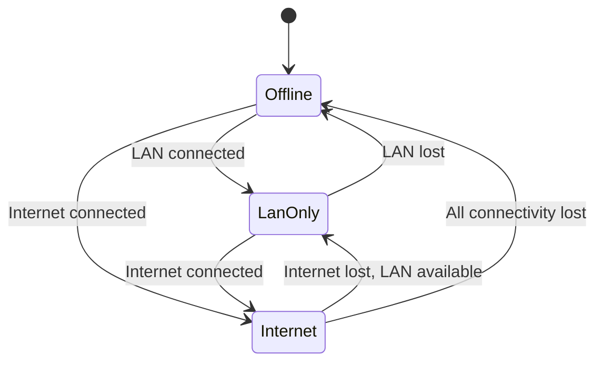

# Aios Model Routing

**Status:** Draft — updated for M3 (gateway architecture, ADR-0006)  
**Depends on:** architecture.md, glossary.md, requirements.md, security-model.md, capability-model.md, message-protocol.md, system-graph.md, decisions/0001-v01-runs-above-linux.md, decisions/0003-fail-fast-no-silent-fallbacks.md, decisions/0006-model-gateway.md

## Purpose

Define how Aios selects model providers, manages connectivity states, enforces
data-sharing consent, handles fallback, and records model provenance.

### Design principles

1. **Model availability is system state.** The current connectivity state and
   provider health determine which models are available. Routing is
   deterministic, not a quality contest.
2. **Token cost is not a design constraint.** Provider selection prioritizes
   safety and data policy over cost. Local models (Qwen, Nemotron) are
   effectively free; external providers are used when their capabilities are
   needed and data policy permits.
3. **Data policy gates routing.** The data classification of a request
   determines which providers are eligible. Secrets never leave the local
   trust boundary (REQ-SAF-006).
4. **Tasks are pinned.** An active task remains on its selected provider and
   model. A new provider may be selected for a later task after connectivity
   changes or a health failure.
5. **Recovery does not require models.** If no model is available, Aios loses
   intelligence but retains deterministic recovery (REQ-REL-002).
6. **Fail-fast on provider failure.** No silent fallback to a degraded model.
   If a provider fails, the task fails and is retried on a configured
   fallback (ADR-0003).

---

## 1. Provider Tiers

Aios uses three provider tiers, ordered by connectivity availability:

```text
Tier 1: Local model (always available if hardware supports it)
Tier 2: LAN gateway (available when LAN is connected and gateway is paired)
Tier 3: Internet provider (available when internet is connected)
```

### 1.1 Tier 1: Local models

| Model | Use case | Resource requirements |
|---|---|---|
| Qwen (local) | Offline baseline for all agent roles | CPU or GPU, 4–8GB RAM depending on quantization |
| Nemotron Nano | Lightweight specialist tasks | CPU, 2–4GB RAM |
| Nemotron Super | Mid-tier specialist reasoning | GPU recommended, 4–6GB VRAM |
| Nemotron Ultra | High-reasoning specialist tasks | GPU, 8–12GB VRAM |

Local models are first-class providers. They are the offline baseline and
the fallback for all tiers. Model weights are separately packaged, verified,
and selected according to the machine's available CPU, memory, storage, and
acceleration.

### 1.2 Tier 2: LAN gateways

A LAN gateway is a trusted machine on the local network with GPU resources.
It must be explicitly paired — discovery does not establish trust.

| Property | Value |
|---|---|
| Discovery | mDNS or manual configuration |
| Trust | Explicit pairing only |
| Authentication | Certificate-based (v0.2+); v0.1: trusted network |
| Data policy | Configured at pairing time |

### 1.3 Tier 3: Internet providers

External providers accessed over the internet. Must be explicitly configured
during setup.

| Provider | Notes |
|---|---|
| OpenRouter | Aggregator — requires downstream provider disclosure |
| Direct providers | Anthropic, OpenAI, Google, etc. |

Aggregators require an additional trust decision: a request may be forwarded
to different underlying providers. Aios must either pin a specific downstream
provider/model or require the gateway to expose its downstream data policy.

---

## 2. Connectivity States

### 2.1 State machine



### 2.2 State definitions

| State | Available tiers | Routing priority |
|---|---|---|
| `Offline` | Tier 1 only | Local model |
| `LanOnly` | Tiers 1, 2 | LAN gateway → Local fallback |
| `Internet` | Tiers 1, 2, 3 | Internet provider → LAN fallback → Local fallback |

### 2.3 State detection

```rust
pub enum ConnectivityState {
    Offline,
    LanOnly,
    Internet,
}

pub fn detect_connectivity() -> ConnectivityState {
    // 1. Check internet connectivity (e.g., HTTP request to known endpoint)
    // 2. Check LAN connectivity (e.g., ping paired gateway)
    // 3. Return state based on results
    // If internet is up → Internet
    // If LAN is up but no internet → LanOnly
    // If neither → Offline
}
```

Detection runs on startup and on connectivity change events. The state is
stored in the System Graph as a node attribute.

### 2.4 State transitions and task pinning

When connectivity state changes:
- **Active tasks remain pinned** to their selected provider and model.
- **New tasks** use the routing priority for the new state.
- If the active task's provider becomes unavailable (health failure, not
  just connectivity change), the task fails and may be retried on a fallback.

---

## 3. Routing Rules

### 3.1 Provider selection algorithm

```text
Input: Task { role, data_classification, task_type, connectivity_state }

1. Determine eligible providers:
   - Filter by connectivity state (tier availability)
   - Filter by data classification (data policy gates)
   - Filter by provider health (unhealthy providers excluded)
   - Filter by task type (some providers may not support all task types)

2. If no eligible providers:
   → If task is safety-critical: DENY (fail-closed)
   → If task is non-critical: queue or fail (no silent degradation)

3. Select provider by priority:
   - Internet state: Tier 3 → Tier 2 → Tier 1
   - LanOnly state: Tier 2 → Tier 1
   - Offline state: Tier 1

4. Pin task to selected provider and model.

5. Record selection in audit log:
   { task_id, provider, model_id, connectivity_state, data_classification }
```

### 3.2 Data classification routing

| Data class | Offline | LanOnly | Internet |
|---|---|---|---|
| **Public** | Local | LAN gateway | Internet provider |
| **Personal memory** | Local | LAN gateway (if trusted) | Internet (if consented) |
| **System config** | Local | Local by default | Local by default |
| **Credentials/keys** | Never sent to any model | Never sent | Never sent |
| **Kernel/security state** | Local | Local or tightly trusted gateway | Local only |

### 3.3 Task type routing

Different agent roles may require different model capabilities:

| Role | Model requirement | Default provider |
|---|---|---|
| Planner | High reasoning, plan generation | Best available tier |
| Verification Agent | Independent reasoning, different model preferred | Different provider than Planner when possible |
| Specialists (diagnosis) | Domain knowledge, tool use | Best available tier |
| Specialists (read-only) | Lightweight, fast | Local model preferred |

### 3.4 Planner and Verification independence

When using the same provider for both Planner and Verification:
- Independence is reduced — both roles may share the same blind spots.
- The broker and Guardian remain necessary regardless.
- For high-risk decisions (risk level 3+), the system should note reduced
  confidence in the audit log.
- If different providers are available, the Verification Agent should use a
  different provider than the Planner.

### 3.5 Fallback behavior

```text
Provider fails (health check, timeout, error):
  1. Mark provider as unhealthy in the model registry
  2. Task fails (fail-fast — no silent retry on same provider)
  3. If task is retried:
     - Select next provider in priority order
     - Must be within configured policy and data classification
     - New task ID (not a silent retry)
  4. Unhealthy provider is re-checked periodically
  5. Provider returns to pool when health check passes
```

---

## 4. Data Classification and Consent

### 4.1 Data classes

| Class | Description | Default routing |
|---|---|---|
| `Public` | Non-sensitive, freely shareable | Any approved provider |
| `PersonalMemory` | User documents, conversation history, preferences | Local or explicitly trusted gateway |
| `SystemConfig` | System configuration, service state | Local by default |
| `Secret` | Credentials, tokens, encryption keys | Never sent to any model |
| `Protected` | Kernel, security, and recovery state | Local or tightly trusted gateway |

Note: `Secret` is a data class for routing decisions, but it is NOT a
`DataClassification` variant in the message protocol. Secret values never
appear in messages — they are injected by the broker directly into
operations. The `DataClassification` enum (message-protocol.md §5.3) has
only `Public`, `PersonalMemory`, `SystemConfig`, and `Protected`.

### 4.2 Consent record

```rust
pub struct ConsentRecord {
    pub consent_id: ConsentId,
    pub provider_id: ProviderId,
    pub policy_version: String,        // Provider's data policy version
    pub data_scope: Vec<DataClassification>,
    pub granted_at: Timestamp,
    pub revoked_at: Option<Timestamp>,
    pub revocable: bool,
}
```

Consent is attached to data classes and provider trust boundaries, not merely
to network availability. Setup establishes trust and privacy rules once.

### 4.3 Setup choices

```text
[ ] Local only
[ ] Local and trusted LAN gateways
[ ] Allow private memory to external providers
[ ] Allow providers that may retain or train on submitted data
```

### 4.4 Provider policy change detection

If a provider changes its retention or training policy:
- Aios detects the policy version change.
- Affected consent records are marked as requiring re-consent.
- No data in the affected scope is sent to the provider until the user
  re-consents.
- The user is notified of the policy change.

### 4.5 Aggregator trust

For aggregators like OpenRouter:
- Aios must either pin a specific downstream provider/model, or
- Require the gateway to expose its downstream data policy.
- Consent to one gateway does not silently imply consent to every unknown
  provider behind it.

---

## 5. Model Registry

### 5.1 Purpose

The model registry tracks all available models — local and remote — with
their metadata, provenance, and health.

### 5.2 Registry structure

```rust
pub struct ModelRegistry {
    models: HashMap<ModelId, ModelEntry>,
}

pub struct ModelEntry {
    pub model_id: ModelId,              // e.g., "qwen-2.5-7b-local"
    pub provider: ProviderId,           // e.g., "local", "lan-gpu-01", "openrouter"
    pub tier: ProviderTier,             // Local, Lan, Internet
    pub capabilities: Vec<ModelCapability>,
    pub provenance: ModelProvenance,
    pub resource_requirements: ResourceRequirements,
    pub health: ProviderHealth,
    pub data_policy: Option<DataPolicy>,
}

pub enum ModelCapability {
    TextGeneration,
    ToolUse,
    CodeGeneration,
    Reasoning,
    Multimodal,
}

pub struct ModelProvenance {
    pub source: String,                 // e.g., "huggingface", "local"
    pub hash: [u8; 32],                 // SHA-256 of model weights
    pub signature_verified: bool,
    pub license: String,
    pub training_data_policy: Option<String>,
}

pub struct ResourceRequirements {
    pub min_cpu_cores: u32,
    pub min_memory_mb: u32,
    pub min_gpu_memory_mb: Option<u32>,
    pub storage_gb: f64,
}

pub struct ProviderHealth {
    pub state: HealthState,
    pub last_checked: Timestamp,
    pub latency_ms: Option<u32>,
    pub error_rate: f64,
}
```

### 5.3 Model selection for local models

Local model selection considers the machine's available resources:

```text
1. Check available CPU, memory, GPU
2. Filter models that fit within available resources
3. Select the highest-capability model that fits
4. If no model fits → no local model available (recovery-only mode)
```

---

## 6. Model Gateway Architecture

The gateway is the single entry point for model access. Agents never talk to
providers directly — they submit generation tasks to the gateway, and the
gateway owns routing, consent, health, pinning, and backend selection.

```text
Agent / Planner
     |
     |  submit(ModelTask, GenerationRequest)
     v
ModelGateway
     |  registry, router, pinner, backends
     |  route() -> RoutingDecision { provider, model, ... }
     v
ModelRouter
     |  connectivity state, consent records, health
     v
ModelBackend (one per provider)
     |-- LocalLlama   -- llama.cpp (local GGUF)
     |-- HttpBackend  -- OpenAI-compatible /chat/completions  (ADR-0006)
```

### 6.1 Gateway responsibilities

- **Provider selection.** `submit()` asks the router for a decision, pins the
  task to the chosen provider/model, and dispatches to the backend.
- **Pinning.** The task stays on its provider/model while active. The pin is
  cleared on completion or failure (§2.4).
- **Health recording.** Successful generations update the provider's latency
  and health; recoverable failures mark the provider unhealthy (§3.5).
- **Fallback.** `submit_with_fallback()` is the fail-fast path: on failure the
  provider is marked unhealthy, a new task ID is issued, and the next eligible
  provider is tried (ADR-0003).

### 6.2 Backend interface

```rust
pub trait ModelBackend: Send + Sync {
    fn provider_id(&self) -> &ProviderId;
    fn is_healthy(&self) -> bool;
    fn generate(&self, request: &GenerationRequest)
        -> Result<GenerationResponse, GenerationError>;
}
```

Backends are registered against a `ProviderId` and are interchangeable: the
gateway holds a map from provider to backend and never branches on provider
kind. `LocalLlama` runs a GGUF through `llama.cpp`; `HttpBackend` (ADR-0006)
speaks the OpenAI-compatible chat API to any LAN or internet provider.

### 6.3 Config-driven providers

Providers are declared in configuration, not hardcoded. Each provider entry
names a backend kind, tier, and where the endpoint or model file lives:

```text
provider:
  id: local-qwen
  kind: local          # LocalLlama backend
  model: models/qwen-2.5-4b-instruct-q4_k_m.gguf
  tier: local

provider:
  id: lan-ollama
  kind: openai-compatible   # HttpBackend (ADR-0006)
  endpoint: http://gpu01:11434/v1
  tier: lan

provider:
  id: openrouter
  kind: openai-compatible   # HttpBackend (ADR-0006)
  endpoint: https://openrouter.ai/api/v1
  tier: internet
```

At startup the gateway loads providers from config, constructs the matching
backend, and registers it with the registry. Routing rules (§3), consent
(§4), and health (§3.5) then apply uniformly — a provider's transport never
changes how it is routed to.

### 6.4 What is implemented

`aios::model` (registry, router, gateway, pinner, backend trait), `aios::hub`
(model metadata, SHA-256 verification of the on-disk model), and `aios::local`
(Llama llama.cpp backend) are implemented and tested. The baseline Qwen model
ships with Aios and is verified on disk — never downloaded at runtime, since
offline mode has no network.

`aios::config` (config loader) and `aios::http` (OpenAI-compatible
`HttpBackend`) landed with M4. Providers are declared in `~/.aios/config.toml`
as `[[provider]]` entries (the §6.3 sketch repeats the `provider:` key for
readability; TOML uses array-of-tables). The `aios shell` facade boots the
gateway from that config and routes chat through it.

---

## 7. Gateway Trust

### 7.1 LAN gateway pairing

```text
Pairing process (v0.2+):
  1. User initiates pairing from Aios setup
  2. Aios discovers gateway via mDNS or manual address
  3. Gateway presents its certificate
  4. User confirms pairing (explicit trust)
  5. Aios stores gateway identity and certificate
  6. Gateway is added to the model registry as Tier 2
```

v0.1: LAN gateways are manually configured. No mDNS discovery. Trust is
assumed on the local network (acceptable for prototype, hardened in v0.2).

### 7.2 Certificate rotation

- Gateway certificates have an expiration date.
- Before expiration, Aios requests a new certificate from the gateway.
- If the gateway cannot provide a valid certificate, it is marked unhealthy
  and removed from the routing pool.
- Expired certificates cause fail-fast rejection.

### 7.3 Downstream provider disclosure

For aggregators:
- The aggregator must expose which downstream provider handled each request.
- Aios records the actual downstream provider in the audit log.
- If the aggregator cannot disclose downstream providers, it can only be used
  for `Public` data.

### 7.4 Replay protection

- Each model request includes a nonce and timestamp.
- The provider must not replay previous responses.
- v0.1: in-process, no replay risk. v0.2+: nonce verification.

---

## 8. Offline Operation

### 8.1 Local model as baseline

The local Qwen model is the offline baseline. It ensures Aios can operate
without any network connectivity:

- Planner and Verification can run offline.
- Specialists can diagnose and recommend offline.
- Staged execution, rollback, and recovery work offline (they are
  deterministic and do not require models).

### 8.2 No model available

If no model can run (hardware too constrained, model weights missing):

- Agents lose reasoning capability.
- The broker, Guardian, and staged executor remain functional.
- Recovery paths remain functional (deterministic, no model needed).
- The System State panel shows `Model: UNAVAILABLE`.
- The user is notified that Aios is in recovery-only mode.

### 8.3 Reduced confidence offline

When operating offline with a single local model:
- Planner and Verification use the same model → reduced independence.
- For risk level 3+ decisions, the audit log notes reduced confidence.
- The Guardian's deterministic checks become the primary safety layer.
- The user may be required to provide additional scrutiny for high-risk
  decisions.

---

## 9. Rust Types

```rust
use crate::protocol::{Timestamp, PrincipalId};
use crate::system_graph::HealthState;

// ── Connectivity ──

#[derive(Clone, Copy, Debug, PartialEq, Eq)]
pub enum ConnectivityState {
    Offline,
    LanOnly,
    Internet,
}

#[derive(Clone, Copy, Debug, PartialEq, Eq, PartialOrd, Ord)]
pub enum ProviderTier {
    Local,   // Tier 1
    Lan,     // Tier 2
    Internet, // Tier 3
}

// ── Provider and model IDs ──

#[derive(Clone, Debug, PartialEq, Eq, Hash)]
pub struct ProviderId(String);

#[derive(Clone, Debug, PartialEq, Eq, Hash)]
pub struct ModelId(String);

// ── Model registry ──

pub struct ModelRegistry {
    models: HashMap<ModelId, ModelEntry>,
}

#[derive(Clone, Debug)]
pub struct ModelEntry {
    pub model_id: ModelId,
    pub provider: ProviderId,
    pub tier: ProviderTier,
    pub capabilities: Vec<ModelCapability>,
    pub provenance: ModelProvenance,
    pub resource_requirements: ResourceRequirements,
    pub health: ProviderHealth,
    pub data_policy: Option<DataPolicy>,
}

#[derive(Clone, Debug)]
pub enum ModelCapability {
    TextGeneration,
    ToolUse,
    CodeGeneration,
    Reasoning,
    Multimodal,
}

#[derive(Clone, Debug)]
pub struct ModelProvenance {
    pub source: String,
    pub hash: [u8; 32],
    pub signature_verified: bool,
    pub license: String,
    pub training_data_policy: Option<String>,
}

#[derive(Clone, Debug)]
pub struct ResourceRequirements {
    pub min_cpu_cores: u32,
    pub min_memory_mb: u32,
    pub min_gpu_memory_mb: Option<u32>,
    pub storage_gb: f64,
}

#[derive(Clone, Debug)]
pub struct ProviderHealth {
    pub state: HealthState,
    pub last_checked: Timestamp,
    pub latency_ms: Option<u32>,
    pub error_rate: f64,
}

// ── Data classification ──

#[derive(Clone, Copy, Debug, PartialEq, Eq)]
// DataClassification is defined in message-protocol.md §5.3 as the
// canonical source. It is NOT redefined here.
// pub enum DataClassification { Public, PersonalMemory, SystemConfig, Protected }
// Note: Secret is NOT a variant — secret values never appear in messages.

// ── Consent ──

#[derive(Clone, Debug)]
pub struct ConsentRecord {
    pub consent_id: Uuid,
    pub provider_id: ProviderId,
    pub policy_version: String,
    pub data_scope: Vec<DataClassification>,
    pub granted_at: Timestamp,
    pub revoked_at: Option<Timestamp>,
    pub revocable: bool,
}

// ── Data policy ──

#[derive(Clone, Debug)]
pub struct DataPolicy {
    pub retains_data: bool,
    pub trains_on_data: bool,
    pub retention_period: Option<Duration>,
    pub policy_version: String,
}

// ── Model router ──

pub struct ModelRouter {
    registry: ModelRegistry,
    connectivity: ConnectivityState,
    consent_records: HashMap<ProviderId, ConsentRecord>,
}

pub struct RoutingDecision {
    pub provider: ProviderId,
    pub model: ModelId,
    pub connectivity_state: ConnectivityState,
    pub data_classification: DataClassification,
    pub reduced_confidence: bool,
}

impl ModelRouter {
    pub fn route(&self, task: &Task) -> Result<RoutingDecision, RoutingError> {
        // 1. Filter by connectivity
        // 2. Filter by data classification
        // 3. Filter by health
        // 4. Filter by task type
        // 5. Select by priority
        // 6. Check consent
        // → RoutingDecision or Error
        todo!()
    }
}

#[derive(Debug)]
pub enum RoutingError {
    NoEligibleProvider,
    ProviderUnhealthy(ProviderId),
    DataClassificationBlocked(DataClassification),
    NoConsent(ProviderId),
    ConsentExpired(ProviderId),
    InsufficientResources,
}
```

---

## 10. Open questions

1. **Model warm-up.** Should local models be pre-loaded into memory at
   startup, or loaded on first request? (Recommendation: pre-load the
   baseline model; load larger models on demand.)
2. **Concurrent model requests.** Can multiple agents use the same local
   model concurrently? (Recommendation: yes, with a request queue. Local
   models are single-instance but can handle sequential requests.)
3. **Model quality comparison.** Should Aios track model quality metrics
   for routing decisions? (Recommendation: no for v0.1. Routing is
   connectivity-based, not quality-based. Quality tracking is v0.2+.)
4. **Dynamic model loading.** Should Aios download and verify new models
   at runtime? (Recommendation: no for v0.1. Models are installed manually.
   Runtime download is v0.2+ with full provenance verification.)
5. **Provider cost tracking.** Should Aios track token costs per provider?
   (Recommendation: yes for external providers, for user visibility. Not
   for routing decisions — routing is safety-first, not cost-first.)

---

## References

- `docs/architecture.md` — section 11 (model routing and offline operation)
- `docs/security-model.md` — section 5 (secrets management), section 4.4
  (model provider compromised)
- `docs/capability-model.md` — section 4 (tool risk levels)
- `docs/message-protocol.md` — section 5.3 (data classification labels)
- `docs/system-graph.md` — section 1.4 (model and gateway layer)
- `docs/requirements.md` — REQ-FUNC-007, REQ-SAF-006, REQ-REL-002
- `docs/decisions/0003-fail-fast-no-silent-fallbacks.md` — provider failure
  causes task failure, not silent degradation
- `docs/decisions/0006-model-gateway.md` — universal OpenAI-compatible
  gateway backend over per-provider backends
